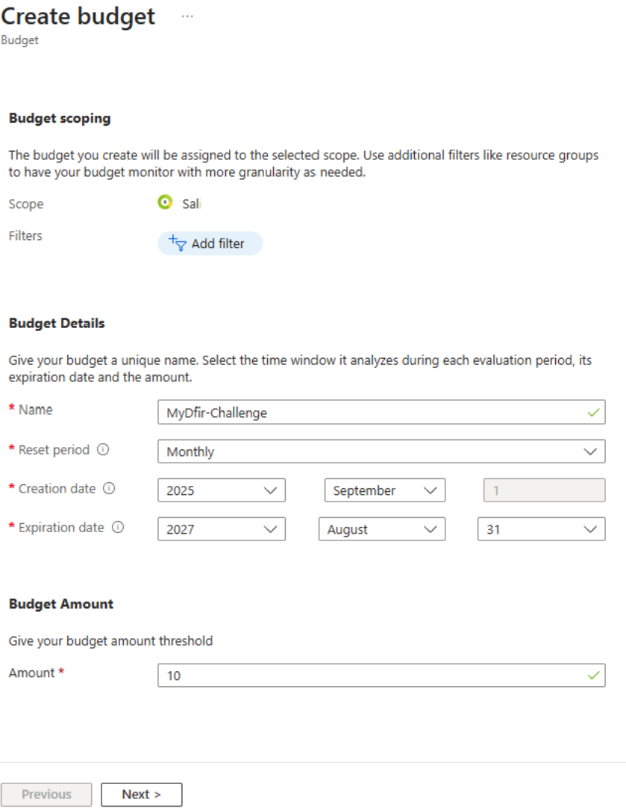
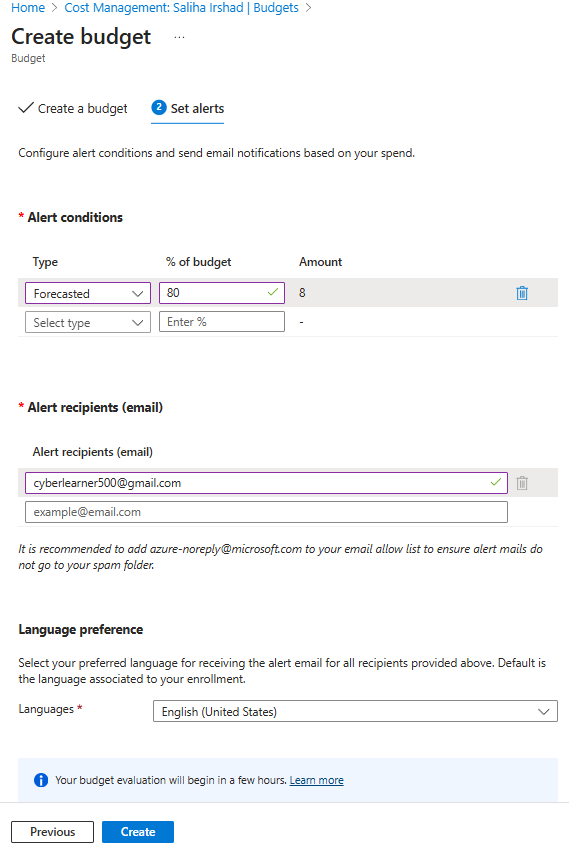
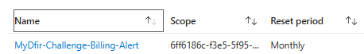

# Requirements
In this section I am documenting what is required for this challenge

- 1 Test Windows 11 VM: to simulate attack scenarios 
    - Created mine in Azure - `mydifr-win11-vm` (then name should have been mydfir, but made a typo)
- Microsoft 365 E5 Trial License  
	- Access to Azure Portal: Will allow us to create VMs and manage our cloud environment.
	- Microsoft Sentinel: Will be our main SIEM, for collecting and analyzing logs.
	- Microsoft Defender XDR: Is going to monitor our test VM for threats and will be used for Phishing attack simulation as well.
	- Microsoft Entra ID: Manages identities, and we can also reduce that to review sign in activity.
	- Microsoft Intune: Will be used to deploy security policies.

# Resources' names
- Test user account: Sal - cyberlearner@cyberlearner.onmicrosoft.com
- Test user VM: mydifr-win11-vm (Public IP: 40.67.200.202)
- External email account: Cyberlearner500@gmail.com
- Billing alert name: `MyDfir-Challenge-Billing-Alert`
- Resource group: `mydifr-sal-RG`
- LA workspace: `mydifr-sal-LAW`
- Workbook: `MyDfir-Sal-Dashboard`
- Bookmark name: `SinginLogs - BruteForce Attempt`
- Bookmark incident name: `MyDfir-Sal-BruteForceAttempt-Incident`

[Defender XDR portal](security.microsoft.com)

### Create a billing alert on Azure
- Go to Microsoft Azure Portal and sign-in with your test account 
- In the search bar, type `Cost Management + Billing`
- Go to `Cost Management -> Monitoring -> Budgets -> + Add` to create budget

- In this case we have selected `Forcasted` under `Alert conditions`, which means if any of our services in Microsoft Azure is going to incur at least 80% of the $10 dollar (which is $8) we set above. If the services hit $8 then we will receive a notification on the specified email.

