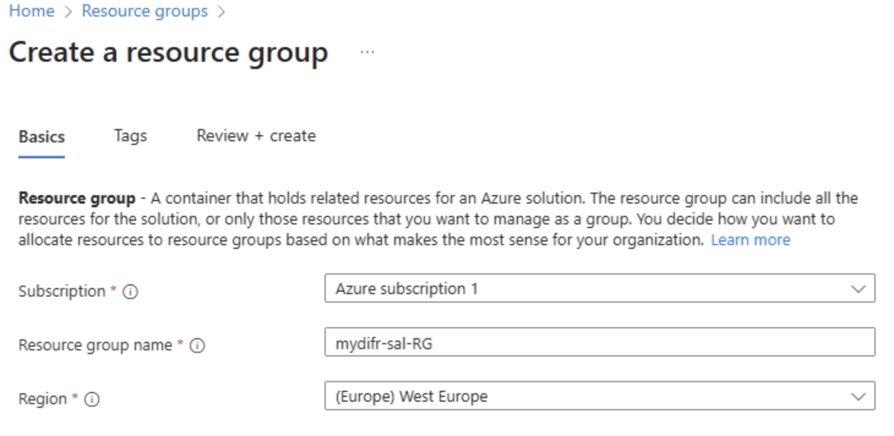
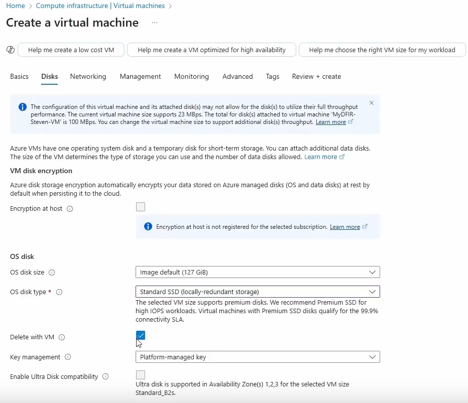
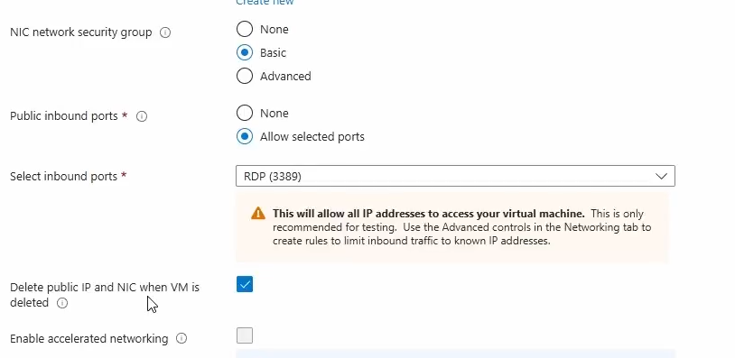
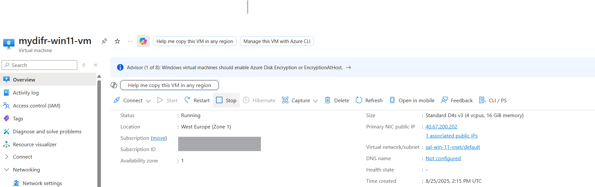
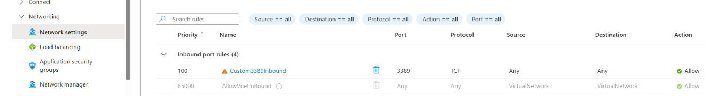
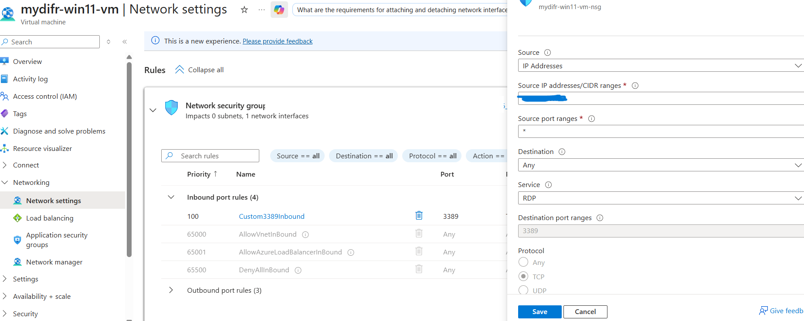

We need a virtual machine to simulate attacks, investigate and hunt for activities and generate alerts. Before creating a VM we need to create a resource group.

# Create a Resource Group 
- Navigate to [Azure Portal](https://portal.azure.com/) and search and select "Resource groups" and click on `+ Create`
- Name the resource group, select your tenant subscription and the region where you want to create it.

- Now any resources (e.g, VM) that we will create will be stored under this resource group.

# Create a Windows 11 VM in Azure
- Navigate to [Azure Portal](https://portal.azure.com/) and search and select "virtual machines" and click on `+ Create` and select `Virtual machine`.
- Select the newly created resource group, Region, Windows 11 Pro images/image and size (e.g. Standard_B2s - 2 vcpus, 4 GiB memory). 
- Then select your username and password and leave the rest as default. 
- Confirm the Licensing. 
-  Under `Disks` tab select the following:

- Under `Networking` tab keep everything as default and check the following setting

- Leave the remaining settings as is and click `Review + create`

## Create an inbound rule (NSG) to restrict RDP
- Open your VM in Azure
- Go to `Networking -> Network settings`
- In the Network security group, under `Inbound port rules`, click the RDP rule
- Change the `Source` and add your public IP there and click on `Save`.

