# Deploy Microsoft Sentinel
Microsoft Sentinel is a cloud SIEM that allows security teams to:
- Ingest and centralize logs from Microsoft (Entra ID, Office 365, Microsoft defender) and Non-Microsoft (Cisco, Checkpoint and Fortinet Firewalls etc.) tools
- Create custom detection rules
- Run automated workflows using playbooks

## Create Log Analytics Workspace in Sentinel
- To get started with Sentinel, we first have to create a Log Analytics Workspace (LAW). So, search for this
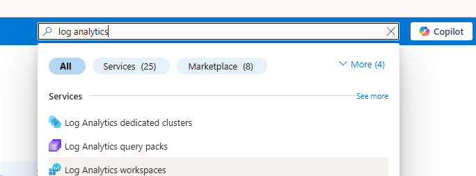
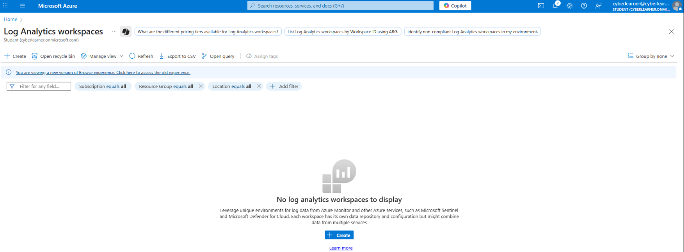
- Create a new workspace: `mydifr-sal-LAW` under your Resource Group and click `Review + Create`
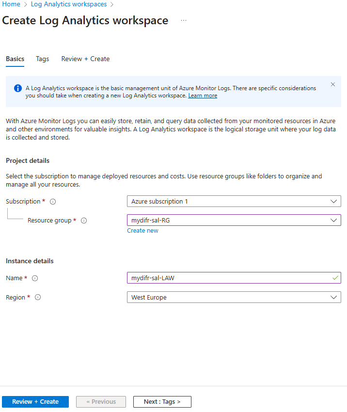
-  Then click `Go to resource`, and you can see the newly created workspace
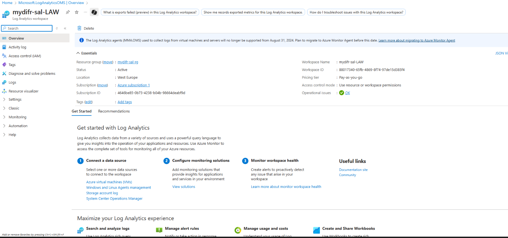

# Install Microsoft Sentinel
Now, our LA workspace is up-and-running. Let's install Microsoft Sentinel:
- Search for Microsoft Sentinel and click on `+ Create`
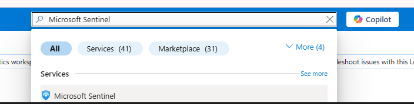
- Select your workspace and click on `+ Add`. This step will add Microsoft Sentinel to your LA workspace.
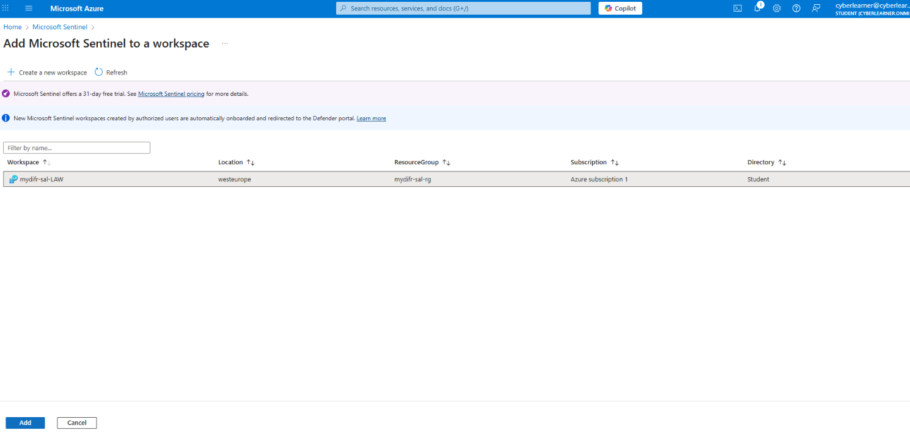
- Activate the free trial and you are ready to work with Sentinel and receive logs
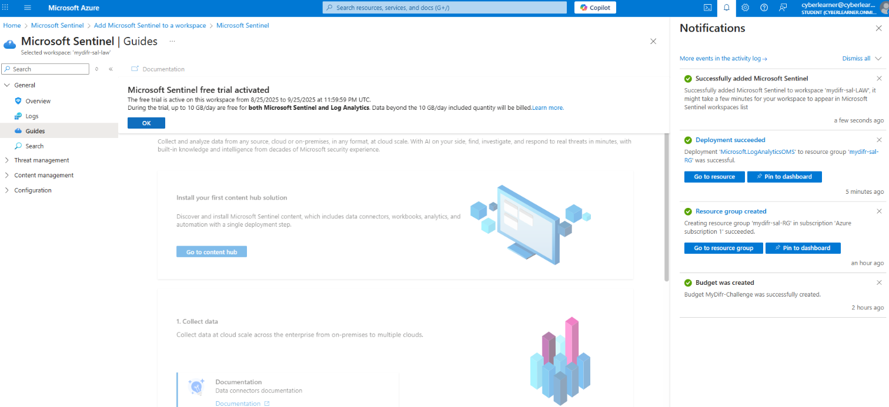

 
 

> Now if you go to Microsoft Sentinel and explore all the tabs, you will not see anything except for the `Logs` tab where you can write KQLs. 
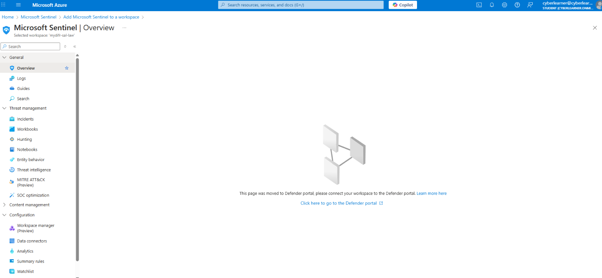
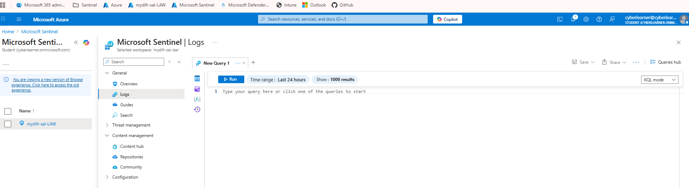

Because as of August 8, 2025 everything was moved to the [Defender XDR portal](security.microsoft.com), which means that you will no longer be configuring your data connectors via the Sentinel blade. Instead, you will configure everything within the Defender portal. For that purpose we will have to connect our LAW workspace in the the Defender XDR portal.

### Connect Sentinel to Defender XDR
- Navigate to [Defender XDR portal](security.microsoft.com)
- Click into `System > Settings > Select Microsoft Sentinel`, Under `SIEM Workspaces` select `Connect Workspace` and select your log analytics workspace that you created earlier. After a couple minutes/hours, your Sentinel instance should now be connected to Defender.
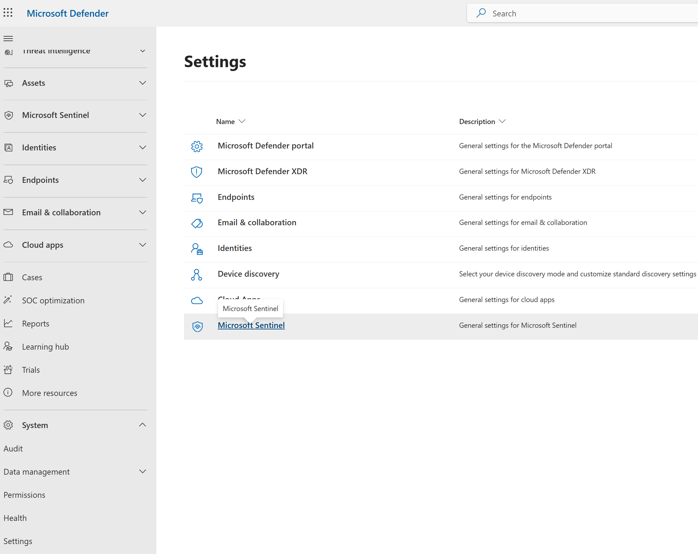
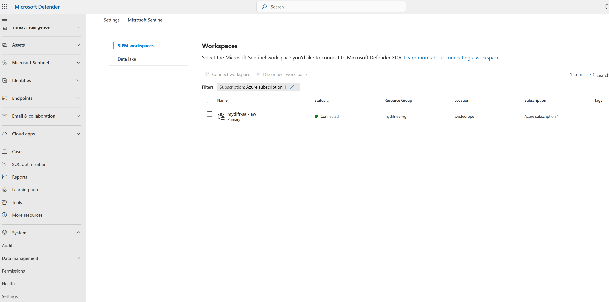
