Let's connect our first data source to Sentinel and use KQL. For that purpose we will connect `AzureActivity` to Sentinel.

## Enable Azure Activity logs
- In Azure portal, search for `Subscriptions -> select your subscription -> click Activity log -> click Export Activity logs`. </br></br>

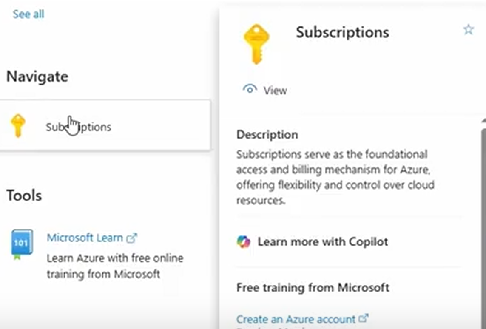
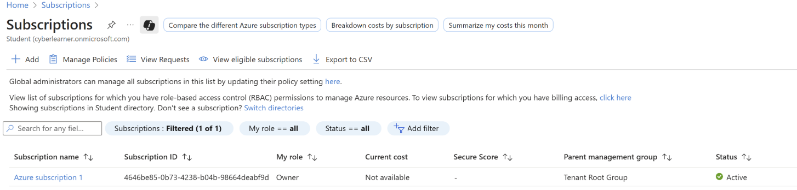
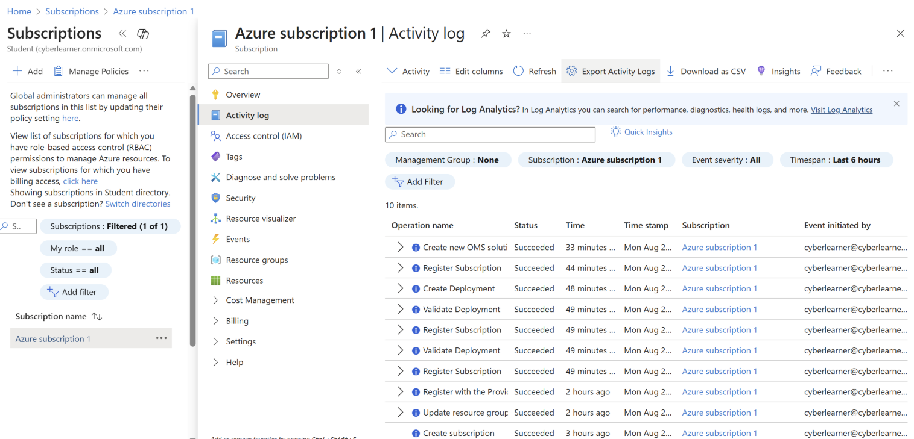

-  Click on `+ Add diagnostic setting`, and we can select what kind of logs and destination where they should be ingested in this case we want to send to our LA workspace.</br></br>
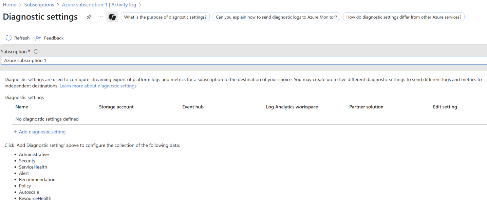
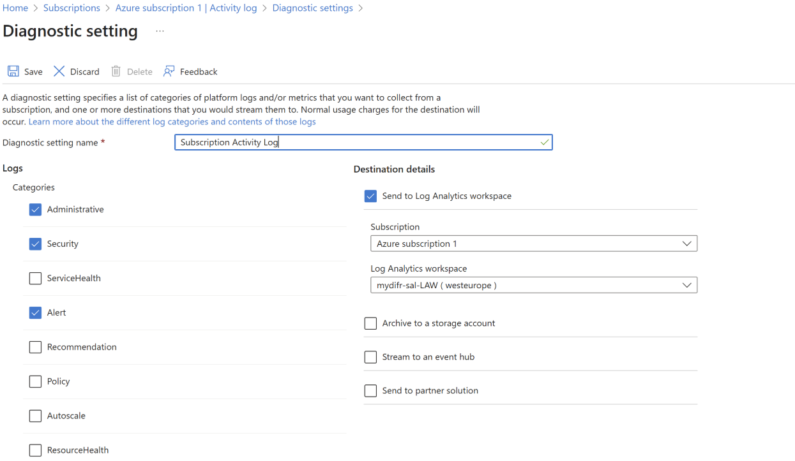


## Connect Azure Activity to Sentinel
- To connect our Azure Activity to our Sentinel instance, got to `Microsoft Sentinel -> Select the correct LA workspace -> Content Management -> Content Hub` (there used to be content here but now its moved to Defender XDR as of August 8,2025). </br></br>
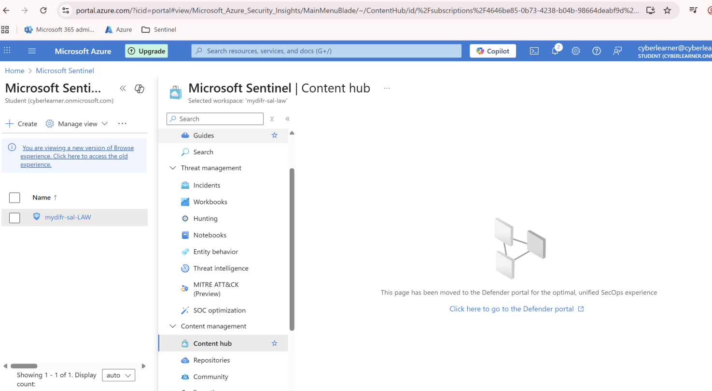 </br></br>
- In Day 3, we already connected our LA workspace to Defender XDR. Now we to access the content hub, click on the `Microsoft Sentinel` tab within Defender portal and select `Content Management > Content Hub`.</br></br>
- Search for `Azure Activity` and install it. </br></br>
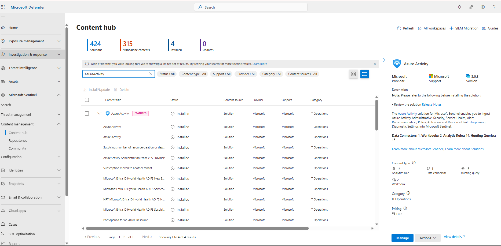 </br></br>
- If you click on `Manage`, you can see the installed content along with `Azure Activity` data connector that allows us to ingest Azure Activity into Sentinel. 
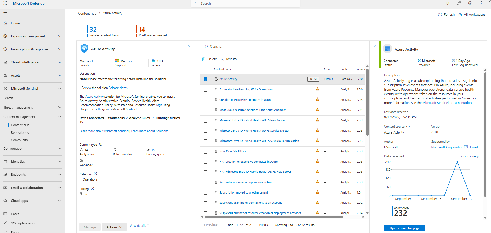
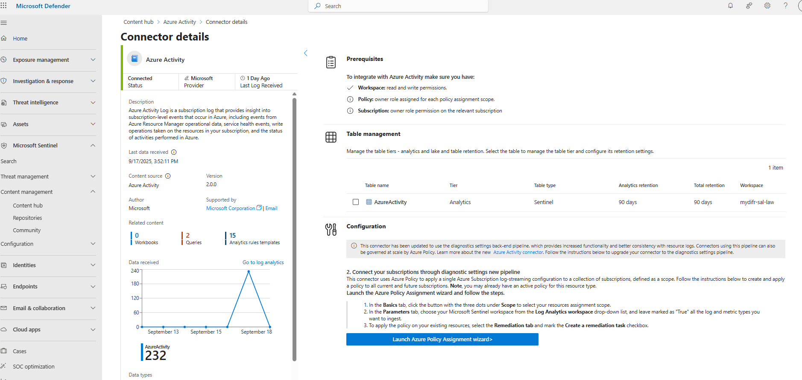
- You can use the following KQL provided by Microsoft to track Azure Activity
```
 let Now = now();
        (range TimeGenerated from ago(7d) to Now-1d step 1d
                | extend Count = 0
                | union isfuzzy=true
                (AzureActivity
                | summarize Count = count() by bin_at(TimeGenerated, 1d, Now))
                | summarize Count=max(Count) by bin_at(TimeGenerated, 1d, Now)
                | sort by TimeGenerated
                | project Value = iff(isnull(Count), 0, Count), Time = TimeGenerated, Legend = "AzureActivity") | render timechart 
```
- After some time, you can see the logs in Sentinel
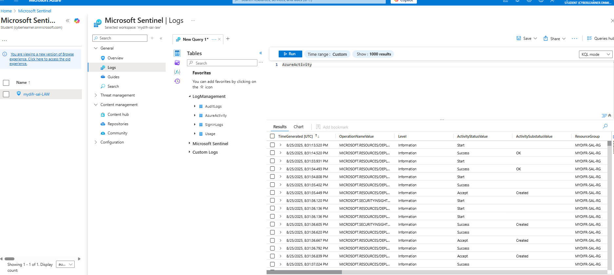

### Example KQLs based on AzureActivity

#### Get distinct OperationNameValue for a specific resource group
```
AzureActivity
| where ResourceGroup contains "MYDIFR-SAL-RG"
| distinct OperationNameValue
```

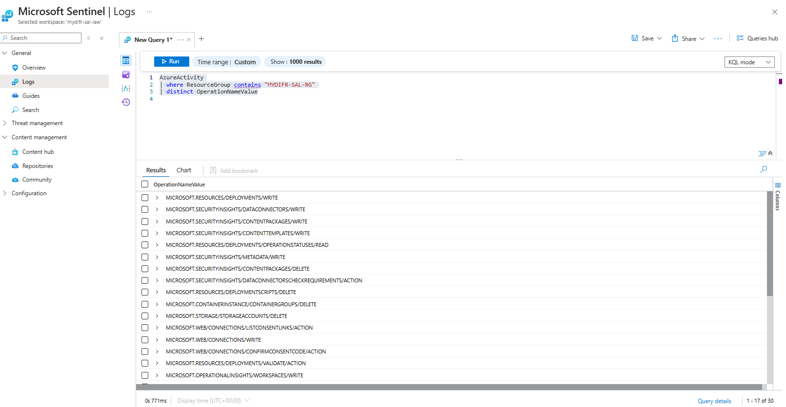

#### Get successful workbook write operations
Suppose we want to monitor latest write operations to workbooks

```
AzureActivity
| where TimeGenerated >= ago(30d)
| where ResourceGroup contains "MYDIFR-SAL-RG"
| where ActivityStatusValue == "Success"
| where ActivitySubstatusValue == "OK"
| where OperationNameValue == "MICROSOFT.INSIGHTS/WORKBOOKS/WRITE"
| summarize arg_max(TimeGenerated, *) by _ResourceId
```

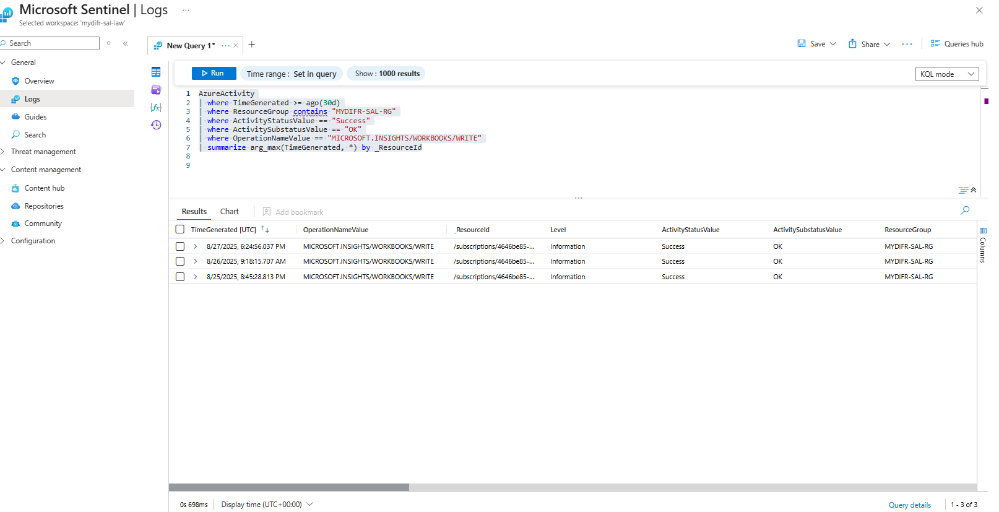


## Setup Microsoft Sentinel Training Lab
We can install the "Microsoft Sentinel Training Lab" which contains sample events to practice KQL skills on.
- Go to Azure Portal in the search bar type Microsoft Sentinel Training, select and install it. It will take 15–20 minutes to install.
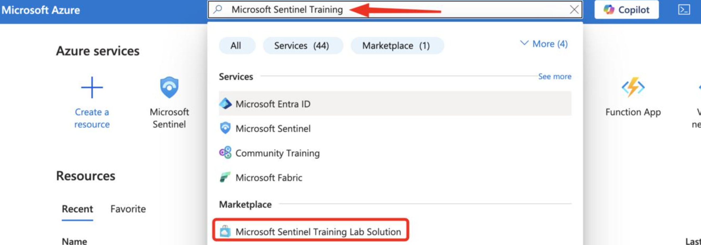
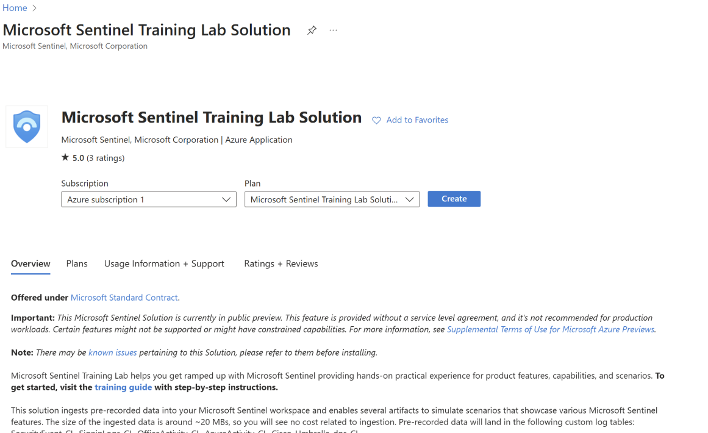
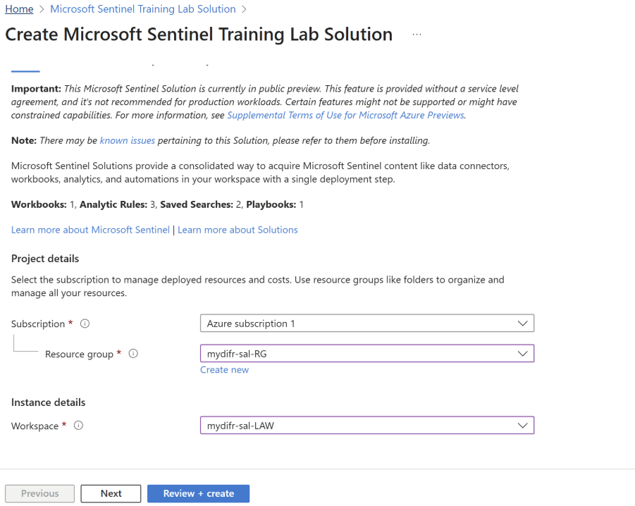
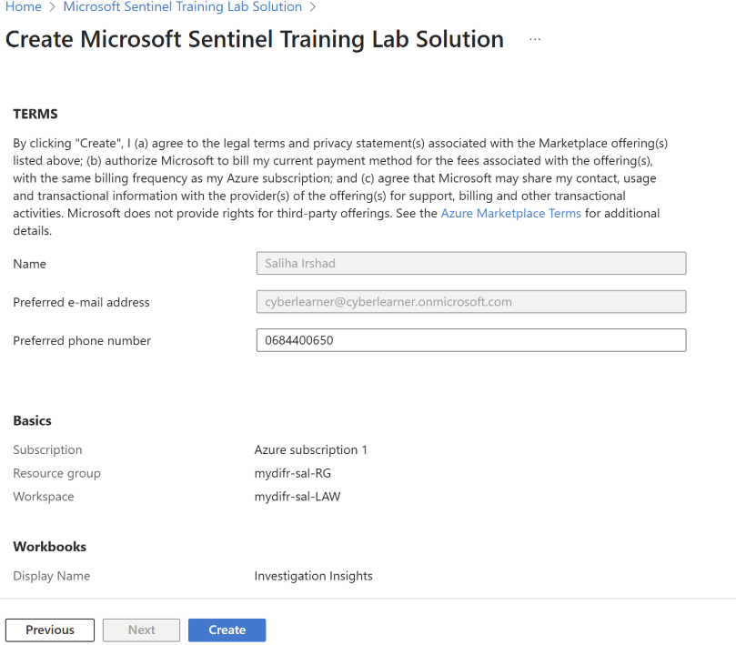
- No in Sentinel click on `Logs` and then select Tables icon, and we can see under `Custom Logs` tables were created after the installation of "Microsoft Sentinel Training Lab" 
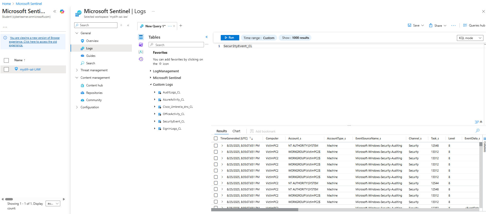

### Get failed login counts for higher than 1000
```
SecurityEvent_CL
| where EventID_s == "4625"
| summarize FailedLoginCount = count() by  Account_s
| where FailedLoginCount > 1000
```
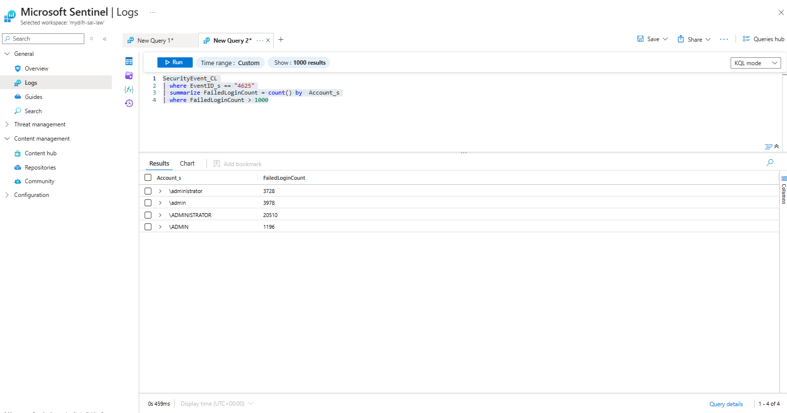