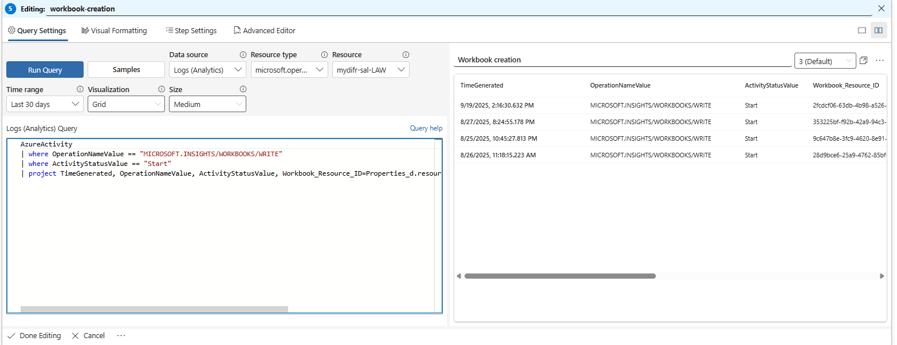

## How to create a workbook
- Navigate to [Defender XDR portal](security.microsoft.com)
- Go to `Microsoft Sentinel -> Threat Management -> Workbooks`, click on `+ Add Workbook`
- This is the default Workbook

- Click on `+ Add` and select `Add data source + visualization`

- You can do the following now:
    - Write a KQL, 
    - Select a `Time range`
    - Select a chart from `Visualization`
    - Add a title
    - Once done, click `Done Editing` button on the query panel
    - Also don't forget to save the workbook. On top of the Workbook click`Done Editing` → `Save`. If you are creating the workbook for the first time then you will see a prompt to name your workbook. I named mine as `MyDfir-Sal-Dashboard`
    

## Example KQLs with visualizations

### Top 5 failed login attempts
This visualization shows us top 5 failed login attempts based on sample data from `SecurityEvent_CL`. We can see the failed logon attempts to admin accounts, which could be an indication that an attacker is trying to do brute force attempts on these accounts so that's worth investigating.

```
SecurityEvent_CL
| where EventID_s == "4625"
| summarize FailedLoginCount = count() by  Account_s
| where FailedLoginCount > 500
| sort by FailedLoginCount desc
| take 5
```


### Workbook creation
This query shows what workbooks are created in an environment. In this case I'm using workbooks but let's say if you want to monitor VM creation you can use `OperationNameValue == Microsoft.Compute/virtualMachines/write`
```
AzureActivity
| where OperationNameValue == "MICROSOFT.INSIGHTS/WORKBOOKS/WRITE"
| where ActivityStatusValue == "Start"
| project TimeGenerated, OperationNameValue, ActivityStatusValue, Workbook_Resource_ID=Properties_d.resource, ResourceGroup, SubscriptionId, Created_By=Caller
```



### Incident status
Track how many incidents are Active vs. Closed vs. New.
```
SecurityIncident
| summarize Count = count() by Status
| render piechart
```


### Incident Distribution by Provider
See which provider (Defender, Sentinel, etc.) contribute most.

```
SecurityIncident
| summarize Count = count() by ProviderName
```

