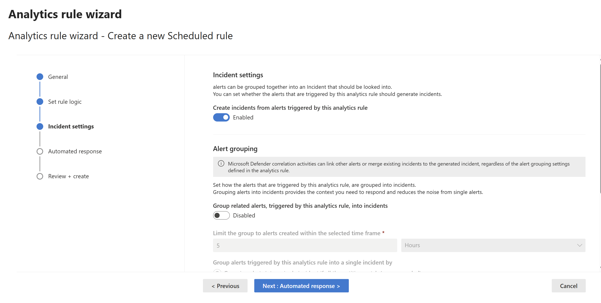

# Difference between Defender XDR and Microsoft Sentinel

Microsoft Defender XDR is a unified platform that pulls in signals from Defender for Endpoint, Defender for Office 365 and more, all in one place. Well yes you are actually using Defender for Endpoint and Defender for Office 365, but you are accessing them via Defender XDR which gives you a single pane view for cross-domain investigations. Without Defender XDR, you'd have to manage each product separately, and you wouldn't get that automatic correlation between email., identity and endpoint.

Microsoft Sentinel is a SIEM, it will collect, correlate and alert on activity across your entire environment. By connecting them you are now building an integrated system. To connect both Microsoft Defender XDR and Microsoft Sentinel together in the past we would install the appropriate data connector. 

What are Data Connectors?
`Data connectors` are what allow Sentinel to receive logs from other Microsoft service like Defender for Endpoint or even from external platforms like AWS, syslog or custom APIs.

# Install Microsoft Defender XDR connector

In Day 3, we already connected Sentinel workspace to Defender XDR for raw event ingestion. But we can still install the XDR connector to get some prebuilt rules/hunting queries and dashboards (workbooks), and the main reason as to why we want to install the connector is to push XDR events into Sentinel. By default, this does not happen.

- The Microsoft Defender XDR connector should be installed from Microsoft Defender (https://security.microsoft.com/). 
- Go to `Microsoft Sentinel -> Content Management -> Content Hub`

- Open Connector Page to select what data source should be ingested to Sentinel

# Create Analytics rule in Defender XDR
- In Microsoft Defender XDR, go to `Microsoft Sentinel -> Configuration -> Analytics`. 
- Click `+ Create` and select `Scheduled query rule`

- Add your KQL and entity mappings

- I'm scheduling the query to run every 5 minutes and selected `Group all events into single alert`

- For Incident settings, make sure `Create incidents from alerts triggered by this analytics rule` is enabled

- Enabled `Alert grouping` as well to group related alerts by IP

- Skip Automated response as we don't have any automation rules yet and click `Review + create` and `Save`.

