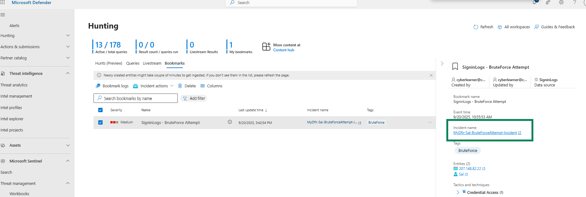

# BruteForce Simulation
I ran this simulation at the end of the project after completing Sections 2, 3, and 4. At that point the Entra ID data connector in Microsoft Sentinel was already enabled and sign-in logs were being ingested into the SigninLogs table (see Day 27 of the challenge). I performed the exercise at the end of the project so the Entra ID connector and SigninLogs ingestion were already in place; this let me personally simulate two brute-force scenarios and verify whether my custom detection would identify them.

## Simulation 1 — Local web client BruteForce
From my host machine I performed approximately 10 failed login attempts against the test user `cyberlearner@cyberlearner.onmicrosoft` via Outlook Web, followed by a successful login within five minutes.


## Simulation 2 — RDP-based BruteForce
- Enabled RDP on my test user's machine `mydifr-win11-vm`
- Started attacker VM `EvilMyDifr-AU-VM` and RDP into it
- From the attacker VM I initiated multiple failed RDP login attempts against test user's (`cyberlearner@cyberlearner.onmicrosoft.com`) Outlook account, followed by a successful login attempt within five minutes.

> For a detailed walkthrough of this simulation, see Section 4 → Final-Project.md.

## Analytics rule creation and detection

After performing Simulation 1, I modified my BruteForce detection query and updated the Analytics rule (`MyDfir-Sal-BruteForceAttempt-Detected`) created in Day 6 which triggered for after performing above simulations. For the sake of demonstration used a time of 2 days. Also note that this is just an example query created for demonstration purposes, it needs to be refined and tested further in the test environment before it can be used in production.

KQL
```
let threshold = 7;
let LogonEvents = SigninLogs
| where TimeGenerated >= ago(2d)
| where OperationName =~ "sign-in activity"
| where AppDisplayName contains "One Outlook Web"
| project TimeGenerated, Identity, AlternateSignInName, AppDisplayName, 
          ResultSignature, UserAgent, UserDisplayName, Status, IPAddress, LocationDetails;
let FailedLogons =
    LogonEvents
    | where ResultSignature has "FAILURE"
    | extend ErrorCode = tostring(Status.errorCode), FailureReason = tostring(Status.failureReason)
    | summarize FailedCount = count(),
                FirstFailedTime = min(TimeGenerated),
                LastFailedTime = max(TimeGenerated),
                AlternateSignInName = make_set(AlternateSignInName)[0],
                ErrorCodes = make_set(ErrorCode),
                FailureReasons = make_set(FailureReason),
                UserAgents = make_set(UserAgent)
          by Identity, IPAddress, bin(TimeGenerated, 15m);
let SuccessfulLogons =
    LogonEvents
    | where ResultSignature has "success"
    | project SuccessTime = TimeGenerated, Identity, IPAddress, UserAgent, UserDisplayName, LocationDetails;
FailedLogons
| join kind=inner (SuccessfulLogons) on Identity, IPAddress
| where FailedCount >= threshold
| extend TimeDifference = datetime_diff('minute', LastFailedTime, SuccessTime)
| where TimeDifference between (1 .. 5)
| project FirstFailedTime, LastFailedTime, SuccessTime, TimeDifference, FailedCount, IPAddress, Identity, AlternateSignInName, UserAgents, ErrorCodes, FailureReasons
```


## Bookmark events
- After running you query in Sentinel, the select interesting event(s). 
- Click `Add bookmark`
- Enter bookmark name and details and click `Create`

- Once created, it can be found in [Defender XDR](https://security.microsoft.com/) under `Microsoft Sentinel → Hunting` and then select the `Bookmarks` tab.


### Create an incident from a Bookmark
From a bookmark, you can create an incident or add it to an existing incident. Just right click and select the option

Bookmark incident name: `MyDfir-Sal-BruteForceAttempt-Incident`


We can see an incident link was added to our Bookmark




## Report

### FINDINGS
- FirstFailedTime [UTC]:
    - 2025-09-18T20:35:02.6356998Z (alert 1 - Simulation 1)
    - 2025-09-20T08:55:53.9316657Z (alert 2 - Simulation 2)
- Affected User: Sal
- AlternateSignInName: cyberlearner@cyberlearner.onmicrosoft.com
- IPs:
    - 207.148.82.22
    - 2a00:abcd:1234:5678:9abc:def0:1357:0008

### ASSUMPTIONS
- A threat actor obtained the user’s credentials and successfully authenticated after multiple failed login attempts. (True)
- Legitimate user mistyped their password repeatedly then logged in successfully. (True)

### INVESTIGATION
Two BruteForce attempt alerts triggered for user Sal (cyberlearner@cyberlearner.onmicrosoft.com) at 2025-09-18T20:35:02.6356998Z (UTC) and 2025-09-20T08:55:53.9316657Z (UTC) respectively. The alerts triggered from two different IPs and locations (NL and AU) for the same user. 

The investigation revealed that the attempt made from NL was done by the legit user who forgot their password and succeeded after multiple failed login attempts. However, the alert from AU, revealed a malicious activity indicating that a threat actor obtained the user’s credentials and successfully authenticated after multiple failed login attempts.

- `Who`: cyberlearner@cyberlearner.onmicrosoft.com (Sal)
- `What`: Multiple failed login attempts followed by a successful attempt detected.
- `When (Time)`: Two BruteForce attempt alerts triggered at 2025-09-18T20:35:02.6356998Z (UTC) and 2025-09-20T08:55:53.9316657Z (UTC) respectively.
- `Where`: The activity took place on an Outlook account with the IP addresses 2a00:abcd:1234:5678:9abc:def0:1357:0008 (NL) and 207.148.82.22 (AU).
- `Why`: User's credentials got compromised resulting in a successful BruteForce attempt. The reason on how the credentials were leaked is still unknown.
- `How`: The user presumably interacted with a Phishing email, navigated to a malicious domain and entered their credentials resulting in a compromise.


#### ACTIONS
**Check SigninLogs, IP and location**

- Checked the `SigninLogs` for the affected user which showed multiple failed login attempts made from two different IPs by the same user.
- Checked the reputation of both IPs on [VirusTotal](https://www.virustotal.com/gui/ip-address/207.148.82.22). The Note: IPs are fake, so results would be clean.
- **Alert 1**: The login location form the first alert showed that the failed login attempts were made from NL with IP 2a00:abcd:1234:5678:9abc:def0:1357:0008. The SinginLogs from past 30 day showed frequent successful logins from same location and IP for this user - indicating that this might be a legit activity from an actual user. 
- **Alert 2**: The login location from the second alert showed that the failed login attempts were made from AU with IP 207.148.82.22. This location has not been used by the user to login before - indicating a malicious attempt and account compromise.


**Contact the user**

- Reached out to the user, who confirmed that he was trying to log in to his Outlook account and entered his password incorrectly multiple times but was able to log in successfully in the end. Hence, confirming that the first alert was triggered by a legit user.
- Regarding the second alert the user denied making any login attempts from his machine and stated that he is currently residing in NL. This also confirms that the second attempt was malicious. 

**Check email and host activity**

- For further investigation, user's Email activity and device activity should check to determine how he got compromised. For example, in this case user's VM had an inbound network rule with RDP configured to "Any" which could be BruteForced itself. But in this example, I just did BruteForce using his Outlook account from user's VM. 

### RECOMMENDATIONS
- Instruct the user to 
    - Change their credentials immediately
    - Either delete the VM if not needed or change VM's inbound rule setting from Any to a specific trusted IP(s) for RDP.
    - Be careful when clicking links in a Phishing email as that could lead to credential harvesting
- Take actions enable MFA company-wide


