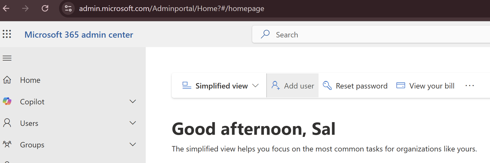
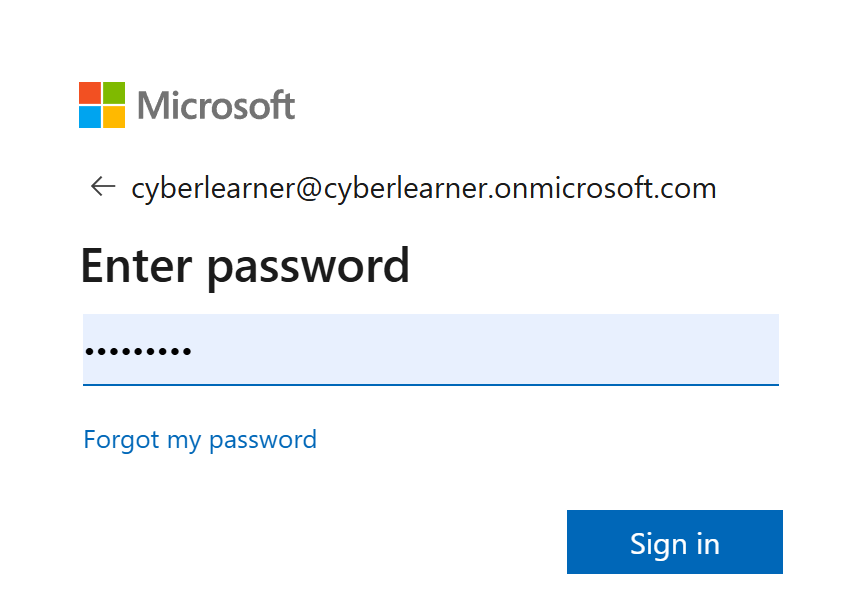

This section covers email security with Microsoft Defender for Office 365. 

## Create new users

- Navigate to [Microsoft 365 admin center](admin.microsoft.com) and sigin with your main account that you used when you activated your `Microsoft 365 E5 license`.

- Click on `Add a user`
- Follow the steps to, fill in fake information to create a user and assign them `Microsoft 365 E5 license (no Teams)` 

If you have multiple Microsoft 365 E5 licenses then you can create multiple users but in my case I only had one `Microsoft 365 E5 license` which was already assigned to to my existing test user (cyberlearner@cyberlearner.onmicrosoft.com). Therefore, I did not create any more users.

## Activate user's outlook mailbox

- Navigate to [Outlook](https://outlook.office.com/mail/)
- Login with your test user's credentials 
- This will activate the user's mailbox

## Overview of Email & collaboration in Microsoft Defender XDR 
You can explore `Email & collaboration` section by navigating to [Microsoft Defender XDR](https://security.microsoft.com/)

- Investigations: If you want Microsoft to automatically investigate a reported or detected email threat
- Explorer:  Is a real-time search and investigation tool for analysing email threats

