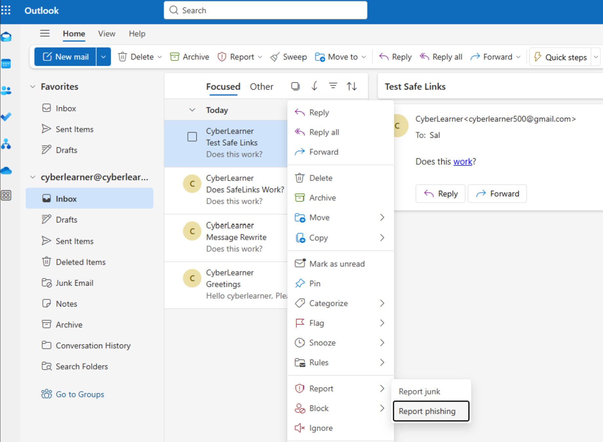
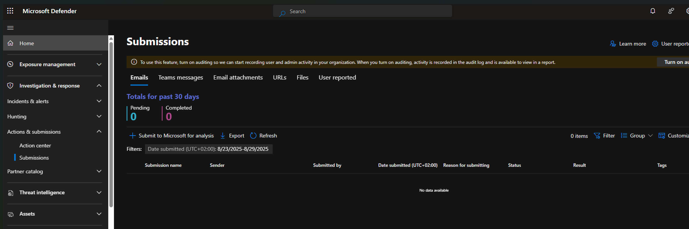
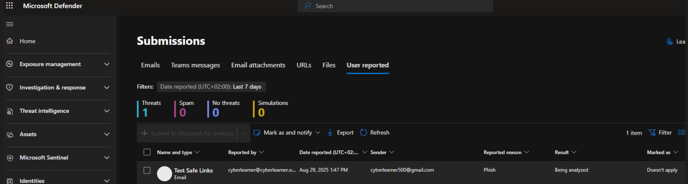
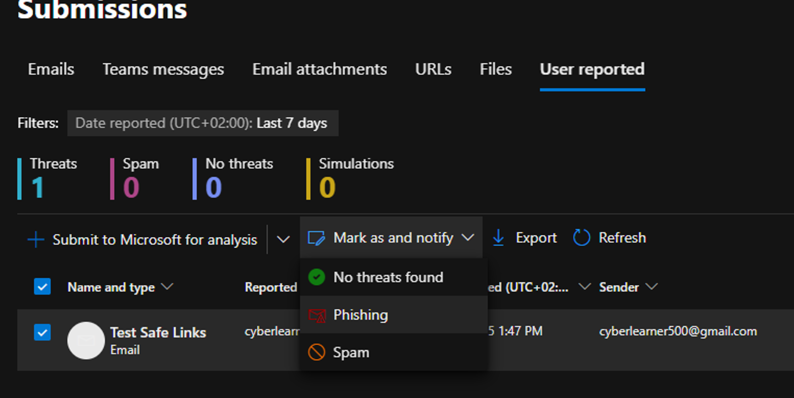
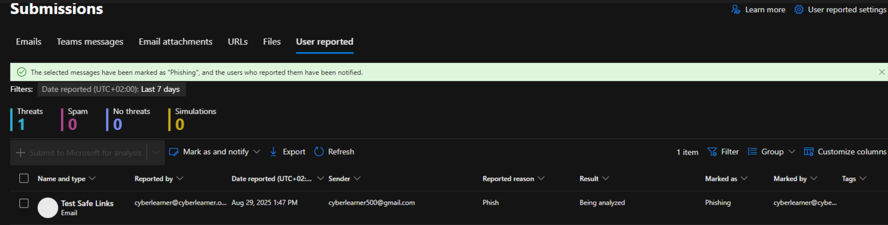
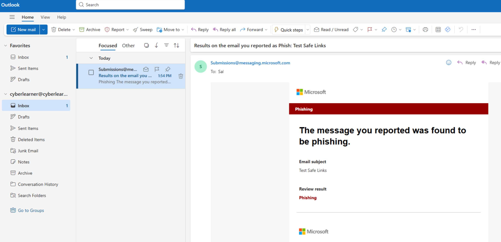

# Reporting Phishing Email
- If a user reports an email message as Phishing, that can be found under `Investigation & response -> Actions & submissions -> Submissions`
- Make sure **Turn on auditing** is enabled to search for user and admin activity

- The reported email can be found under **User reported**

- You can also use **Mark as and notify** to tag as Phishing, Spam or No threats foun based on your investigation. 

- Let's mark it as Phishing and the user will receive a notification email on their reported email from Submissions@messaging.microsoft.com

- These tools provide visibility on analysing phishing attempts, track user clicks and validate your policies.
