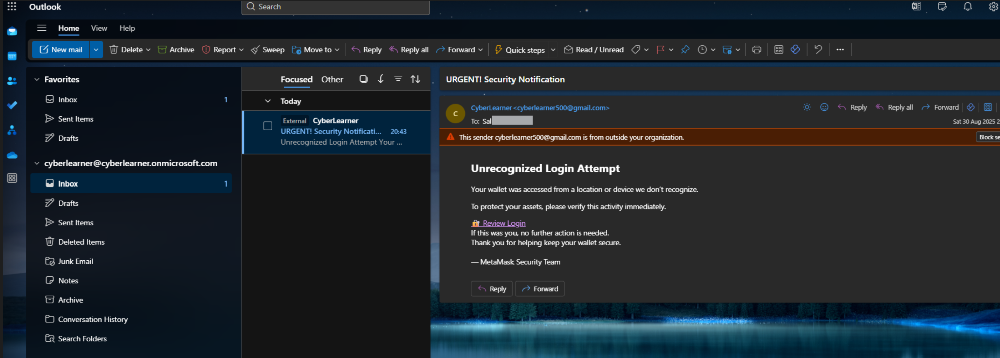
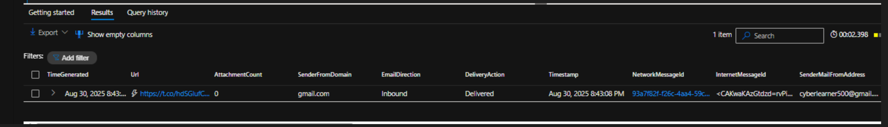
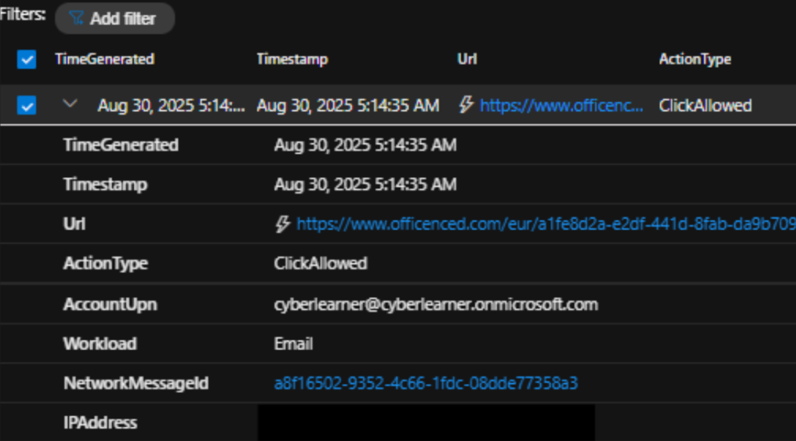

# Objective: 

Simulate a suspicious email, then walk through how a SOC analyst would investigate and respond.

## Simulate phishing email
For simulation, the email sample was taken from mydifr SOC community's custom labs challenge ([Email #2](https://www.skool.com/mydfir/classroom/aee138db?md=01939dbdd423450abc7a3e5576d118b7)). I sent this test email from an external gmail account to my test user account in Outlook.


## Email investigation report

**FINDINGS**
- Time: 2024-03-11 14:21:18 UTC
- Sender: cyberlearner500@gmail.com``
- Recipient: cyberlearner@cyberlearner.onmicrosoft.com
- Attachments: None
- Submitted URL: hxxps[://]t[.]co/hdSGlufCET?id=7833882918994061387-6045
- Effective URL: hxxps[://]anoukroams[.]com/bmw/

**ASSUMPTIONS**
- A threat actor is attempting to harvest credentials (True)
- User entered their credentials on a credential harvesting website (False)
- It is a normal business communication email (False)
``
**INVESTIGATION**
The email was sent from an external sender pretending to be a Security team, showing urgency and asking use to take an action on a "Unrecognized Lоgіn Attempt". The email suggests the user to clik "🔐 Review Lоgіn" button to verify their credntials leading to a possible credential harvesting website.

- `Who (Recipient)`: cyberlearner@cyberlearner.onmicrosoft.com
- `What`: An email with a likely credential harvester was sent to a user asking them to click and login from the provided link.
- `When (Time)`: The email was received by only one user on 2024-03-11 14:21:18 UTC.  The user did not click any links and reported the email as Phishing. 
- `Where`:  The email was sent by an external sender (cyberlearner500@gmail.com) to only one user (cyberlearner@cyberlearner.onmicrosoft.com). No business communication was found in the environment with this sender before.
- `Why`: This is a social engineering attact in attempt to steal user's credentials.
- `How`: The email pretended to be a security notification, urging user to enter their credentials.

**ACTIONS**
- Checked URL reputation on [VirusTotal](https://www.virustotal.com/gui/url/ce7dd641d86d54e2b36315b1d34a0fde3dc5134fe35a572c14516f1a678ea8fe?nocache=1) and was reported as Phishing by one vendor.
- Detonated the URL on [urlscan.io](https://urlscan.io/result/0198fc02-28a7-76c1-b0ea-7c8cc1728d8e/): The Submitted URL redirects to a potential credential harvester website which is currently down.
- Checked Email Logs:
    - Only one user received a phishing email from this sender in past 30 days. Thus, no Phishing campaigns observed.
        ```
        EmailEvents
        | where Timestamp >= ago(30d)
        | where SenderFromAddress  == "cyberlearner500@gmail.com"
        | where RecipientEmailAddress == "cyberlearner@cyberlearner.onmicrosoft.com"
        | where Subject contains "urgent! security notification"
        | join kind=leftouter (EmailUrlInfo) on NetworkMessageId
        | join kind=leftouter (EmailAttachmentInfo) on NetworkMessageId
        | project-reorder TimeGenerated, Url, AttachmentCount, SenderFromDomain, EmailDirection, DeliveryAction
        ```
        
    - The user did not click the malicious link. 
        ```
        UrlClickEvents
        | where SenderFromAddress  == "cyberlearner500@gmail.com"
        | where RecipientEmailAddress == "cyberlearner@cyberlearner.onmicrosoft.com"
        ```
        
    - No outbound email communication was observed.
        ```
        EmailEvents
        | where Timestamp >= ago(30d)
        | where RecipientEmailAddress == "cyberlearner500@gmail.com"
        | project-reorder TimeGenerated, SenderFromAddress, SenderFromDomain, RecipientEmailAddress, EmailDirection, DeliveryAction
        ```
    - If proxy logs are present, then you can check if some has browsed the suspicious domain. In this case no one did.

**RECOMMENDATIONS**

The reported email was indeed Phishing leading to a credential harvester. 

- No user clicked the malicious link and no Phishing campaigns were observed. The Urls should be blocked.
- Block the sender domain if you are sure that it has no business impact on your environment (In this case, the sender is coming from gmail and by blocking this, it would likely cause availability issues for the business.)
- Purge the email from recipient's mailbox. 
- Close the incident as TruePositve with no business impact after performing the recommended containment actions.


