# What is Microsoft Defender for Endpoint
- It is an enterprise grade endpoint detection and response platform (EDR)
- It continuously monitors the connected endpoints for process executions, file - creations, network connections, registry changes, and image load events.

# Onboard Test VM
We will onboard our test VM with `Microsoft Defender for Endpoint`, to collect real endpoint telemetry (events like malicious files, suspicious commands, lateral movement etc.)

- Navigate to the [Microsoft 365 Defender portal](https://security.microsoft.com)
- To configure how your EDR would behave, enable the following settings:
    - In the left sidebar, select `System -> Settings -> Endpoints -> General -> Advanced features` and save your preferences
    - Enable EDR in block mode
    - Enable Custom network indicators
    - Tamper protection (on by default)
    - Enable Web content filtering
    - Enable Live Response
    - Microsoft Intune connection
    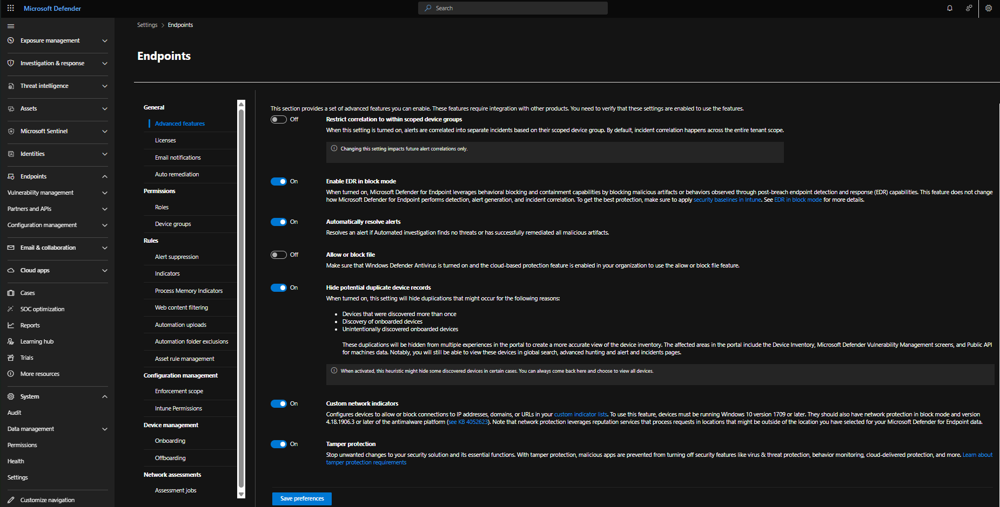</br>
    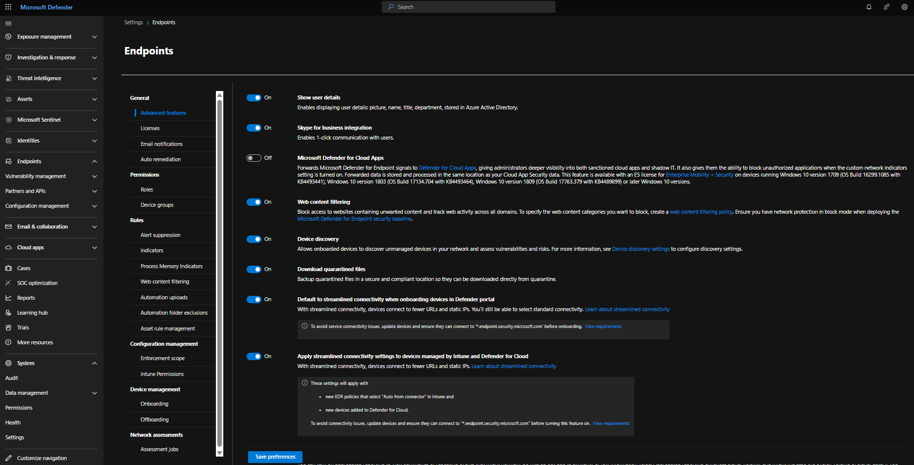</br>
    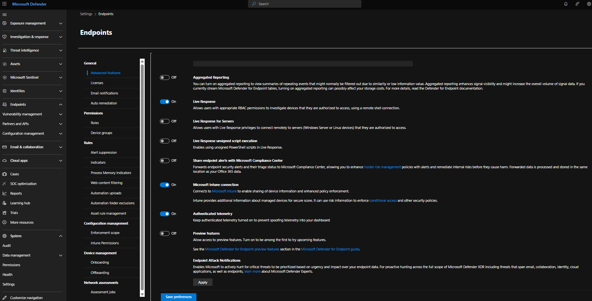</br>
- Next, to onboard our test Windows 11 VM to Microsoft Defender for endpoint, navigate to `System -> Settings -> Endpoints -> Device management -> Onboarding`. Select the settings as shown in the screeshot below and click `Download onboarding package`.
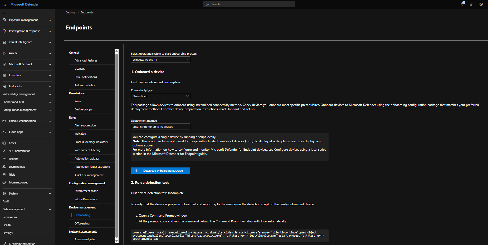

> **NOTE:** </br></br>
> If you get the following error, just refresh the page and try to download the onboarding package again:


# Install onboarding package on Test VM
- After downloading the Defender onboarding package, RDP into you test VM and paste the Defender onboarding package into your VM. To RDP into an Azure VM, open the RDP client on your host machine and enter your VM's credentials:
    - Computer: VM's public IP (40.67.200.202)
    - Add User Account: Enter your VM's credentials
    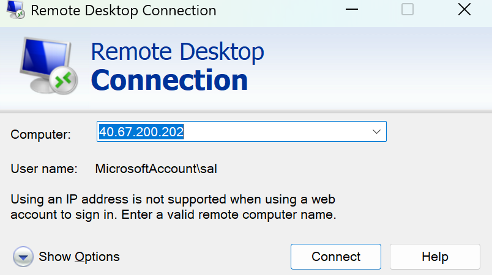
- Extract the onboarding package and run the following script as administrator
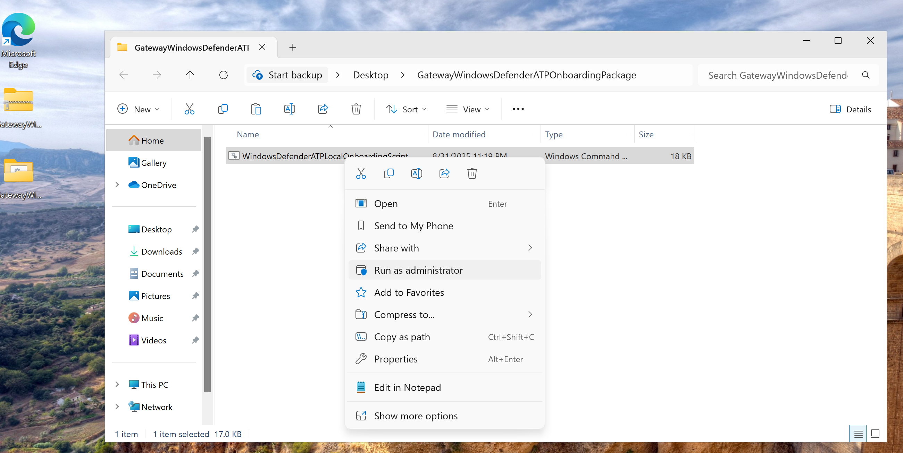 <br>
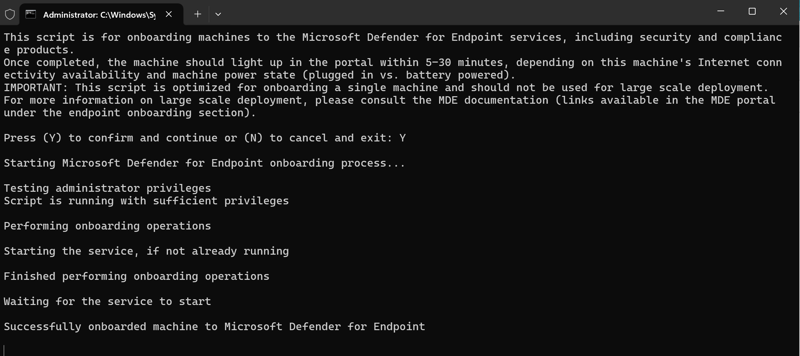

- Back in the Defender for Enpoint portal, under `2. Run a detection test` we can see `First device detection test: incompete:`
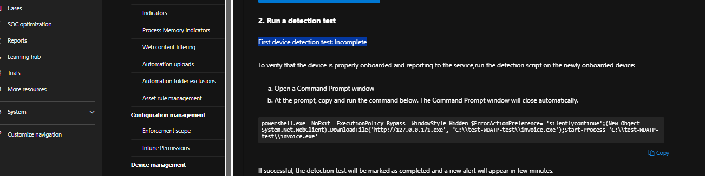

- To test if the device has successfully onboarded, run the following command in your VM's cmd:
    ```
    powershell.exe -NoExit -ExecutionPolicy Bypass -WindowStyle Hidden $ErrorActionPreference= 'silentlycontinue';(New-Object System.Net.WebClient).DownloadFile('http://127.0.0.1/1.exe', 'C:\\test-WDATP-test\\invoice.exe');Start-Process 'C:\\test-WDATP-test\\invoice.exe'
    ```
    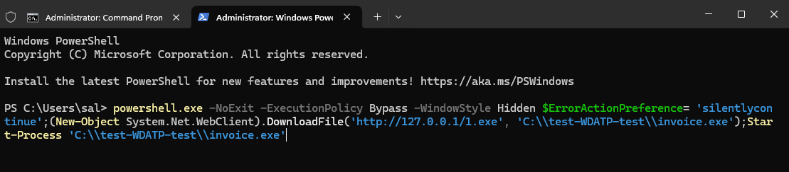

- After waiting for a few minutes. we can see that the status has changed to `complete`, which means that our VM has been successfuly onboarded to Microsoft Defender for Endpoint.
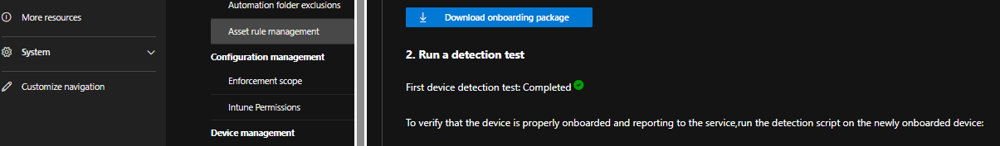
- To further confirm this, you can go to `Assets -> Devices`
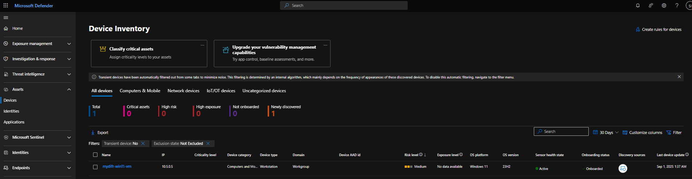

> **NOTE:** </br></br>
> if the status is still incomplete after waiting for sometime, just right click the command and paste it again in the cmd in your test VM and execute.


 