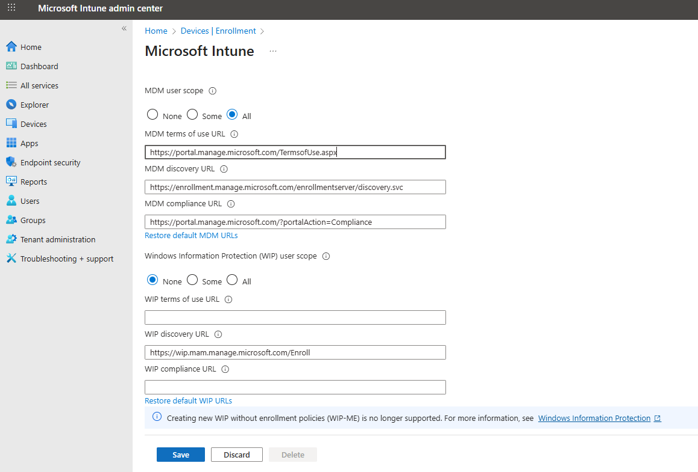
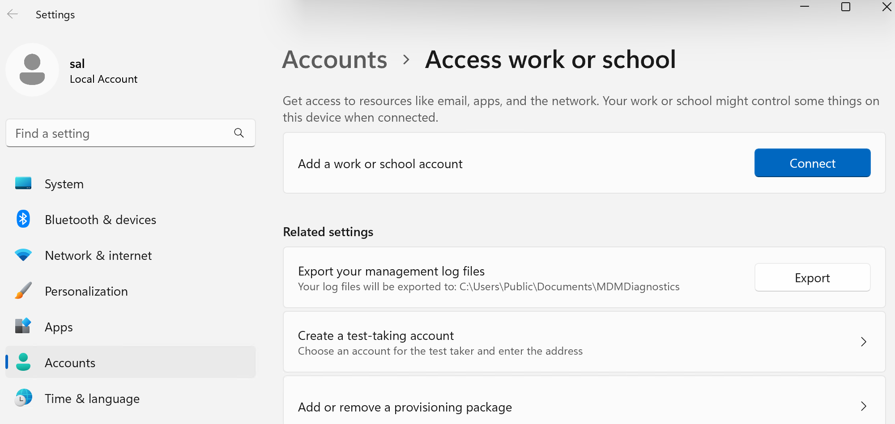

# What is Microsoft Intune
It is an enterprise grade platform used to manage and protect endpoints at scale. This is where you can configure an ASR rule.

# Attack Surface Reduction (ASR) Rules

ASR rules are a set of protections that help block suspicious malware behaviour like:
- Office macros spawing Powershell
- Ransomware encryption behaviour
- strange execution patterns
- unusual app behaviors
- Malcious links or files from the internet executing code etc.

These rules are used by organizations to harden their endpoints.

# Enroll an Endpoint into Intune
Following are the steps to join your test user account to a test VM and enable RDP from that user account.

- Navigate to [Microsoft Intune admin center](https://intune.microsoft.com/#home)
- From the sidebar select `Devices -> Device onboarding -> Enrollment`. Under `Enrollment options`, select `Automatic Enrollment`.

- Under `MDM user scope` select `All` and click `Save`

- RDP into your test Windows VM
- Open `access work or school`, click on `Connect` for `Add a work or school account`. Then select `Join this device to Microsoft Entra ID` and sign in with your test user (`CyberLearner`) account. Going forward this VM is going to be that user's (`CyberLearner`) device.
  
  
  
  
  

- Now let's sign in with our `CyberLearner` user account
- Open the RDP app from your host machine, click `Show Options`. Go to `Advanced` tab and enable `Use a web account to sign in to the remote computer`. Do note with this option checked you are no longer able to RDP into the test VM with its public IP address.

- Head over to your Azure portal, select your VM. Copy computer name under `Overview -> properties`. Now go back to RDP app and replace the IP with copied computer name.

- We get another error, because our host machine cannot resolve this hostname  (mydifr-win11-vm) to an IP address. 

- To bypass this, lets open our local host DNS settings.
 - Open Notepad with administrative access
 - Open `hosts` file from `C:\Windows\System32\drivers\etc`
 
 - Enter the public Ip address of your test VM followed by the computer name and save.
 
 - Now go to RDP client and connect. You should get a pop-up allowing you to sigin in with your test account. 
   
   

- Now in Microsoft Intune admin center select `Devices` and under `Windows` section we should see a device connected.

Go to `Endpoint security -> Setup -> Microsoft Defender for Endpoint` and turn the following settings on and save

We can see the connection status is enabled and last synchronized date and time

Now we can push out policies to our endpoints to automatically onboard onto Microsoft Defender for Endpoint or configure policies for additional protections, which is covered in next section.

# Configure ASR rules in Intune

In above section we enrolled our endpoint into intune. Now lets create an ASR policy in Intune:

- Go to `Endpoint security -> Attack surface reduction` click on `Creat Policy` and select the following example settings:

- These policies can be applied to only groups. You can either select the group from the drop down or create a custom group by clicking on `Groups` in the left side bar.

- For this example we will select `All devices` group and save the policy

- The policy has been created

- To determine, if the policy was applied successfuly just click into the policy

