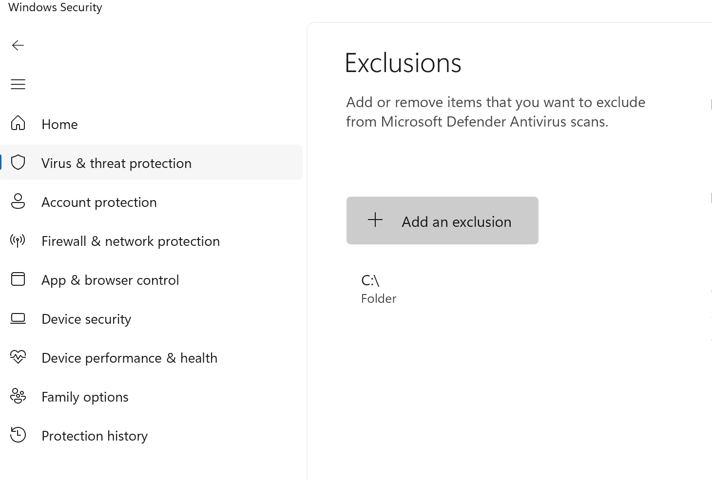
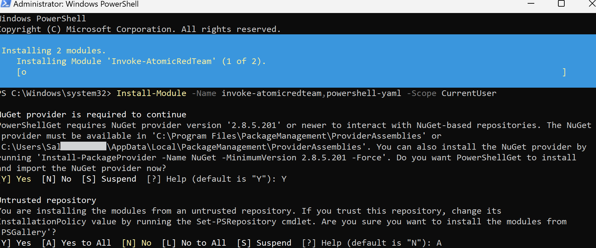
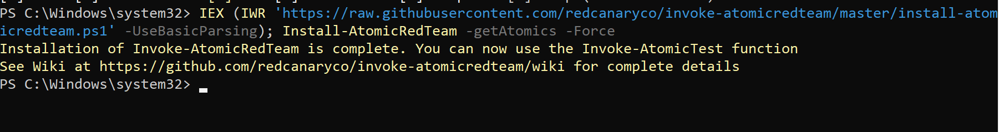
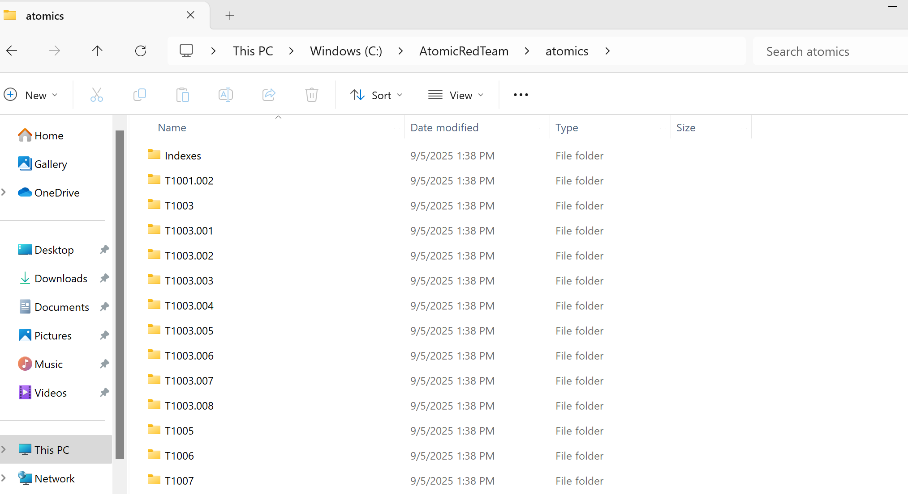
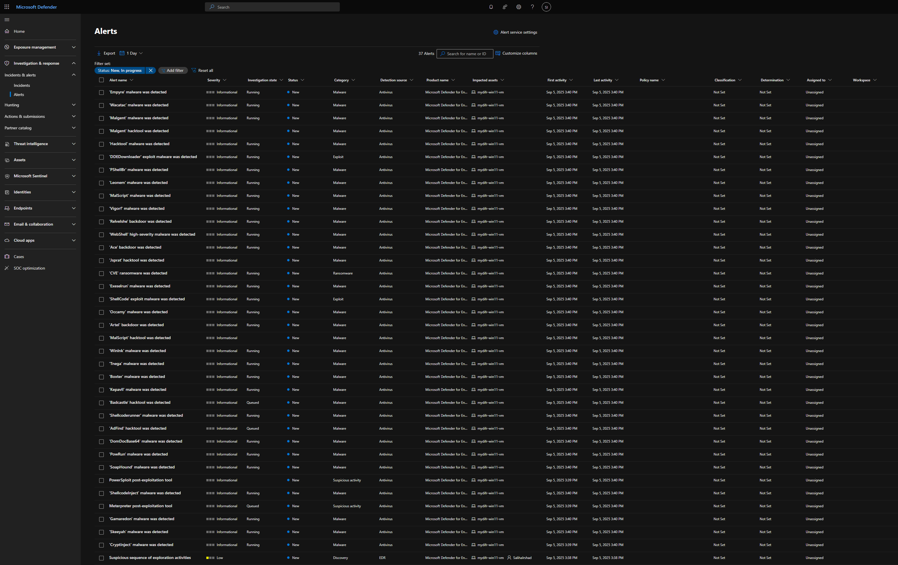
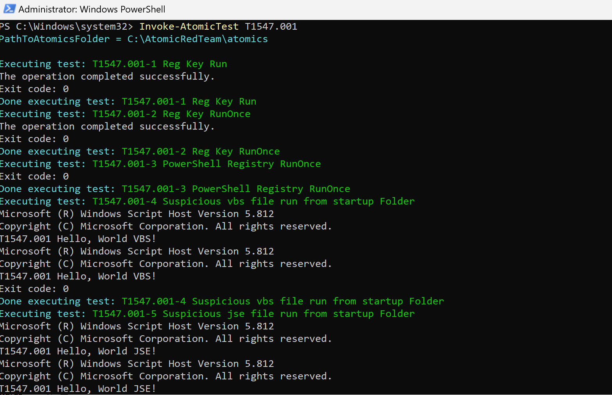
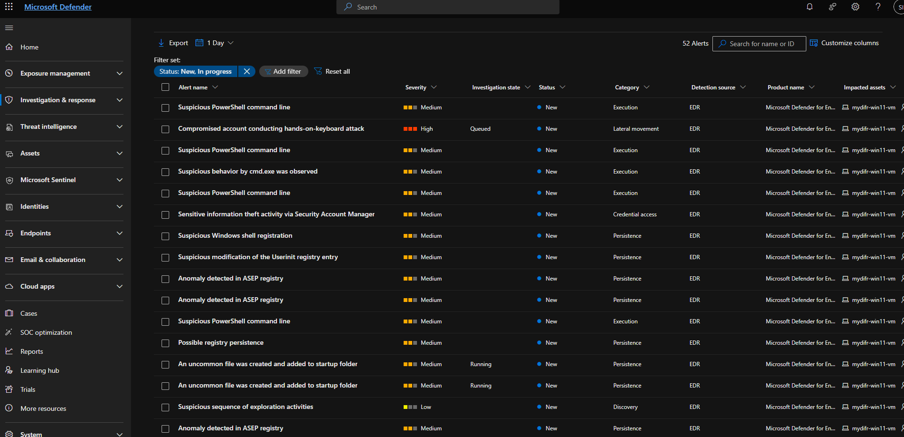

# Simulate suspicious activity using Atomic Red Team

The goal is to simulate suspicious activity on our test VM using AtomicRed Team which is a popular tool for testing endpoint detections by mimicking real adversary behaviour. The idea of this exercise is to trigger alerts in Microsoft Defender for Endpoint and observe how it responds. Atomic Red team is a project by Red canary that lets you test detection coverage for specific MITRE attact techniques, you can run single command line scripts to simulate suspicious behaviour. 

## Install Atomic Read Team
- RDP into your test VM and login using your test account (created in Day 19)
- Go to `Windows Security` -> `Virus & threat protection` -> `Manage settings` -> `Exclusions` -> `add or remove exclusions` -> click on `Add an exclusion` -> Select `Folder` and add your `C:\` drive here.

- Open PowerShell as adminsitrator and run the following command
```
Install-Module -Name invoke-atomicredteam,powershell-yaml -Scope CurrentUser 
```


Paste the next command to install Atomic Red Team and you will see a folder called `AtomicRedTeam` in your `C:\` drive. The `AtomicRedTeam -> atomics` folder contains various MITRE techniques 
```
IEX (IWR 'https://raw.githubusercontent.com/redcanaryco/invoke-atomicredteam/master/install-atomicredteam.ps1' -UseBasicParsing); Install-AtomicRedTeam -getAtomics
```


- Because of the installation we can see a couple of alerts have already triggered in Defender for Endpoint


## Run Atomic Test

```
Invoke-AtomicTest T1547.001
```


Back in Defender we can see a lot of alerts are generated
