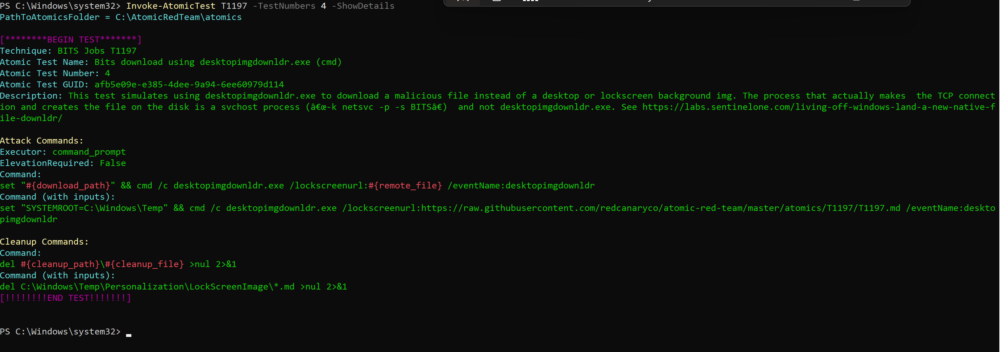
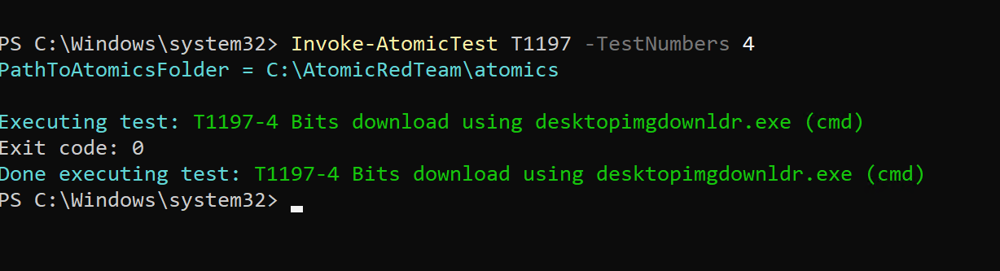
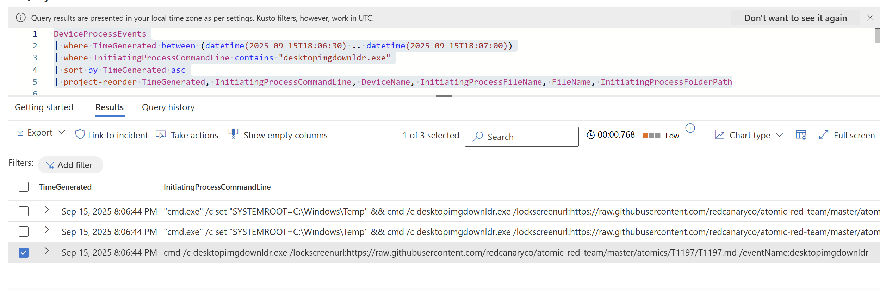
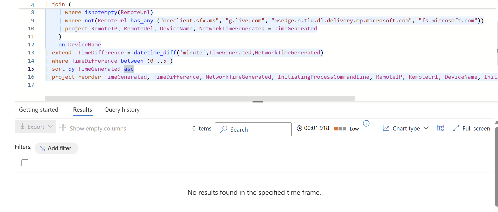
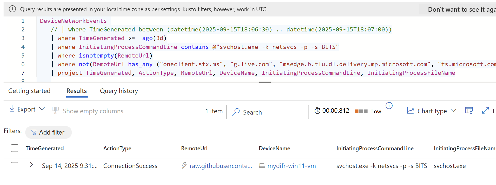
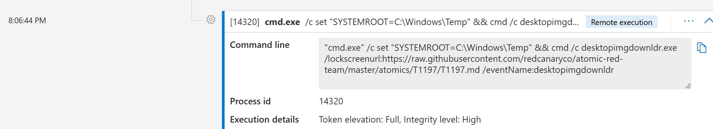

# Simulate and hunt an activity

## Goal
- Run Atomic Red Team tests for  MITRE ATT&K technique T1197 - BITS Jobs on test VM and forward logs to Defender.
- Create a hypothesis and hunt for Atomic Test #4 - Bits download using desktopimgdownldr.exe (cmd)

## Simulation

Simulated Atomic Test #4  - Bits download using desktopimgdownldr.exe (cmd):

```
Invoke-AtomicTest T1197 -TestNumbers 4 -ShowDetailsBrief

Invoke-AtomicTest T1197 -TestNumbers 4
```



## What is desktopimgdownldr.exe
desktopimgdownldr.exe is a legitimate Windows binary used by the Personalization/lockscreen feature to fetch images (desktop or lock-screen backgrounds) from a URL or Microsoft service. In normal use it is called with a /lockscreenurl: (or similar) pointing to a trusted image (jpg/png) on Microsoft CDNs or vendor CDNs, and the BITS service (running as svchost.exe -k netsvcs -s BITS) performs the actual download and saves the image to the Personalization/LockScreenImage folder. Attackers abuse it by supplying an arbitrary URL (pointing to a malicious .exe or script), so suspicious desktopimgdownldr invocations followed by svchost outbound connections to non-Microsoft domains likely indicate abuse.


## Hypothesis 
Unusual `desktopimgdownldr.exe /lockscreenurl:` invocations that reference non-Microsoft or non-image URLs and are followed (within minutes) by svchost.exe -k netsvcs -s BITS network activity to those same hosts indicate likely abuse of the BITS download flow to fetch arbitrary/malicious files.


## Hunt and Report

### Findings
- Time [UTC]: 2025-09-15T18:06:44.5976051Z
- URL: https://raw.githubusercontent.com/redcanaryco/atomic-red-team/master/atomics/T1197/T1197.md 
- InitiatingProcessCommandLine: cmd  /c desktopimgdownldr.exe /lockscreenurl:https://raw.githubusercontent.com/redcanaryco/atomic-red-team/master/atomics/T1197/T1197.md /eventName:desktopimgdownldr

### Investigation
On 2025-09-15T18:06:44.5976051Z [UTC] a command with `desktopimgdownldr.exe /lockscreenurl:` refrencing a  URL to download GitHub raw .md file (not an image or Microsof service) was executed on host mydifr-win11-vm indicating it is a test or abuse rather than normal behavior.

The results partially support my hypothesis because telemetry was only generated for DeviceProcessEvents in Defender and logged the following events.

```
DeviceProcessEvents
| where TimeGenerated between (datetime(2025-09-15T18:06:30) .. datetime(2025-09-15T18:07:00))
| where InitiatingProcessCommandLine contains "desktopimgdownldr.exe"
| sort by TimeGenerated asc
| project-reorder TimeGenerated, InitiatingProcessCommandLine, DeviceName, InitiatingProcessFileName, FileName, InitiatingProcessFolderPath
```


After the execution of the `desktopimgdownldr.exe /lockscreenurl:` command, checked for the BITS network activity device network events within a window of 5 minutes. No data was logged in Defender for this activity.

```
DeviceProcessEvents
| where TimeGenerated between (datetime(2025-09-15T18:06:30) .. datetime(2025-09-15T18:07:00))
| where InitiatingProcessCommandLine contains "desktopimgdownldr.exe"
| join (
    DeviceNetworkEvents 
    | where TimeGenerated between (datetime(2025-09-15T18:06:30) .. datetime(2025-09-15T18:07:00))
    | where InitiatingProcessCommandLine contains @"svchost.exe -k netsvcs -p -s BITS"
    | where isnotempty(RemoteUrl)
    | where not(RemoteUrl has_any ("oneclient.sfx.ms", "g.live.com", "msedge.b.tlu.dl.delivery.mp.microsoft.com", "fs.microsoft.com"))
    | project RemoteIP, RemoteUrl, DeviceName, NetworkTimeGenerated = TimeGenerated
    )
    on DeviceName
| extend  TimeDifference = datetime_diff('minute',TimeGenerated,NetworkTimeGenerated)
| where TimeDifference between (0 ..5 )
| sort by TimeGenerated asc
| project-reorder TimeGenerated, TimeDifference, NetworkTimeGenerated, InitiatingProcessCommandLine, RemoteIP, RemoteUrl, DeviceName, InitiatingProcessFileName, FileName, InitiatingProcessFolderPath
```




The telemetry for BITS network activity was logged by Defender just once for a different (T1197-1 Bitsadmin Download (cmd)) simulated a day before this test. So the assumption is that Defender samples or deduplicate network telemetry, hence not logging the same results again. 

```
DeviceNetworkEvents 
    // | where TimeGenerated between (datetime(2025-09-15T18:06:30) .. datetime(2025-09-15T18:07:00))
    | where TimeGenerated >=  ago(3d)
    | where InitiatingProcessCommandLine contains @"svchost.exe -k netsvcs -p -s BITS"
    | where isnotempty(RemoteUrl)
    | where not(RemoteUrl has_any ("oneclient.sfx.ms", "g.live.com", "msedge.b.tlu.dl.delivery.mp.microsoft.com", "fs.microsoft.com"))
    | project TimeGenerated, ActionType, RemoteUrl, DeviceName
```



Even though desktopimgdownldr.exe execution followed by the BITS network activity was not logged. The command execution was detected by the Defender alert "Suspicious bitsadmin activity"



### Recommendations
Investigate the following:
 - Was URL malicious and what was downloaded on the host machine.
 - Did anyone else browsed to the URL
 - Block the URL