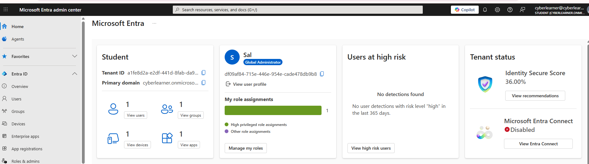

# Entra Admin portal

Entra ID protection continuously monitors user sign-in and account behavior. It looks for anomalies like:
- Impossible travel which are sign-ins from two distinct locations that are too close together.
- Sign-ins from unfamiliar locations or anonymous IP addresses like VPNs or Tor nodes.
- Password sprays and brute force attempts
- Token replay and session hijacking
- Users flagged as high-risk based on their behavior or external threat intelligence.

Entra ID protection assigns a risk level to both sign-ins and users. It looks at behavior, geography, device finger prints and signals to detect anomalies.

# Overview of Microsoft Entra portal
- Navigate to [Microsoft Entra admin center](https://entra.microsoft.com/#home) and login with your account.
. 

## Entra ID

### Conditional access
Allows you to create policies to block, allow or enforce multifactor authentication under certain conditions, if MFA is not already enforced. If something is risky then do something

### Monitoring & health
- **Sign-in logs**: Allows you to track from where and how the users are logging in.
- **Audit logs**: Allows you to track configuration changes across your tenant.

Microsoft Entra admin center is where you will manage the identity layer when it comes to your tenant. To help protect those identities you can utilize Identity (ID) Protection.

## ID Protection

Microsoft offers different policy settings to protect the identity layer. There are two types of identity risks

- **User risk policy**: A long term account risk signaling that the entire account might be compromised. Maybe a user's credentials were found in a data breach, or they triggered malicious activities in the past. Think of user risk as the person being risky.
- **Sign-in risk policy**: A risk that is tied to a specific login. Is a particular sign-in suspicious e.g. did it come from a high risk country? Or was it from a malicious IP or from Tor browser. Think of sign-in risk as the session being risky.
