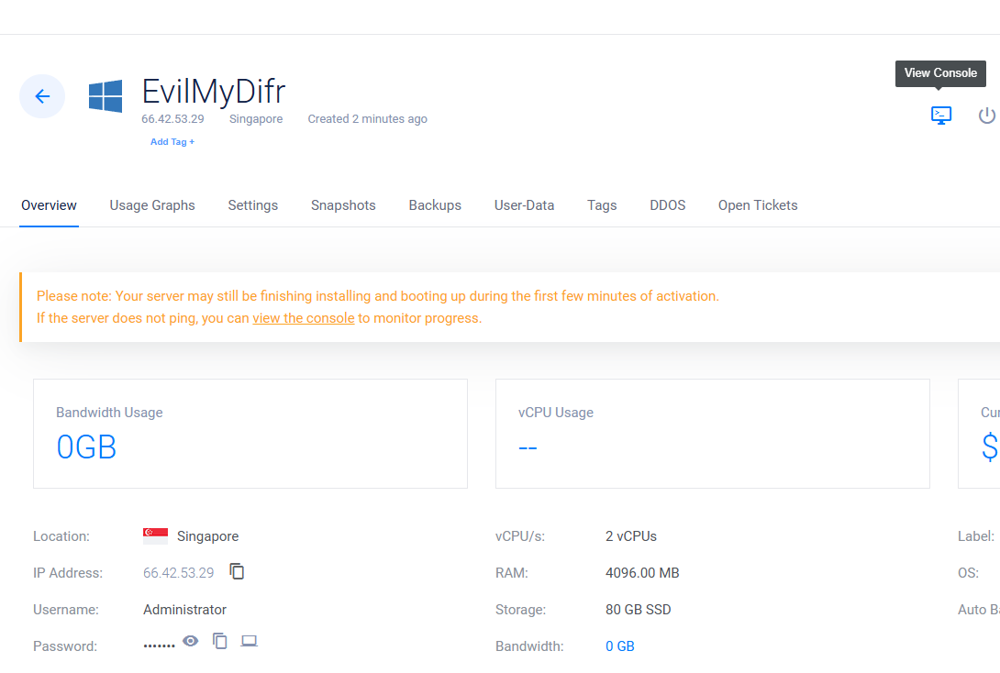

# Conditional Access 

Create a CA policy if the sign-in is coming from a country that we do not do business with. In this case block the access entirely.

- Sign-in with your test user account in Outlook. Once we sign in this will create a sign-in event within Entra ID. This will be used as our legitimate activity. 
- Navigate to [Microsoft Entra admin center](https://entra.microsoft.com/#home). Go to `Monitoring & health -> sign-in logs` and filter on your test user assume this activity to be legitimate from that location and IP.

## Simulate risky sign-in 
Create a VM in a region different from your test account who logged into Outlook (as above because we will consider that as legit activity). For that purpose we will create a VM in Vultur.

- Navigate to Vultur portal 
- Go to `Compute -> Deploy Server`
- Select `Shared CPU` and the region where you want to create the VM. In this example it is Asia (Singapore) and select VM specs and then click on `Configure Software`

- Selected Windows Server 2016 and named it as `EvilMyDifr`

- In Additional Features, remove automatic backups

- Click `Deploy`
- Click into the VM and click `View Console` button to check if it has deployed or not
- 
- Now lets copy the IP address of this VM (`66.42.53.29`) and RDP into it from our host machine.

- Downloaded Google Chrome on this VM (reason is that Internet Explorer block lots of content when browsing from a server. To bypass those security controls we need chrome or any other browser)
- Browse to "https://www.whatismyip.com/" to find the public IP of this VM, to make sure it's sourcing from Singapore

- Now open Outlook and sign-in as our test user (`CyberLearner`) and it asks us for MFA. So here the assumption is that the attacker has acquired `CyberLearner's` credentials and when the attacker sign-ins, they see the following:

- In Entra ID we see the event generated based on above malicious sign-in attempt with IP `66.42.53.29` from Singapore and MFA is enabled. We can more information by clicking the events and going through different tabs inside it. For example if you click on Conditional Access, you will see an MFA policy called `Security defaults` applied by default. These are defaults that are enabled for all Entra ID P1 and P2 plans. The control for this policy makes sure that for the sign-in to be successful it must require MFA. When the attacker did not provide MFA, this event became `Interrupted`, hence the Status is `Failure`.

- Let see if the Sign-in risk was detected in `Risky sign-ins`

## Create a Conditional Access policy
Let's create CA policy to block connections from Singapore, as we do not do business with it.

- Go to `ID Protection -> Dashboard -> Protect -> Conditional Access -> Manage -> Named locations -> + Countries location` to create a list of countries to block (in this case Singapore) 

- Go to `Conditional Access -> Policies -> New Policy`. But first we have to disable existing `security defaults` 
. In a new tab, go to the `Entra Admin portal -> Entra ID -> Overview -> Properties -> Manage security defaults`

- Again go back to `Conditional Access -> Policies -> New Policy` and refresh the page, and now we no longer see the warning to disable `security defaults`.

- `Name`: Create a new policy `MyDFIR-Sal-CAPolicy`
- `Assignments`: Select the user(s)

- `Target resources`: All resources
- `Network`: select the following

- `Conditions`: Keep default
- `Access controls` → `Grant` → select `Block access`

- `Enable policy`: select `On` and click `Create`

On our CA, policy is in place let's try to log in again with our `CyberLearner` account from m our `EvilMyDifr` VM. Now the access is blocked, and we don't see the MFA prompt because it's sourcing from a blocked country
