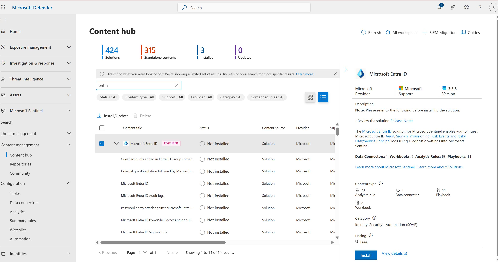
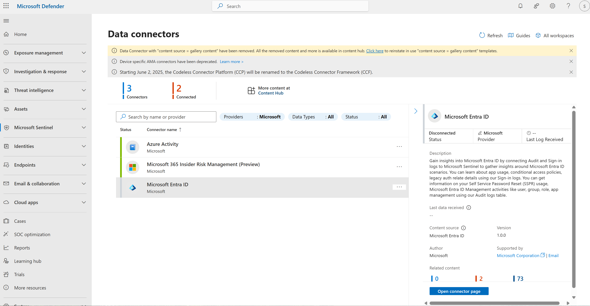
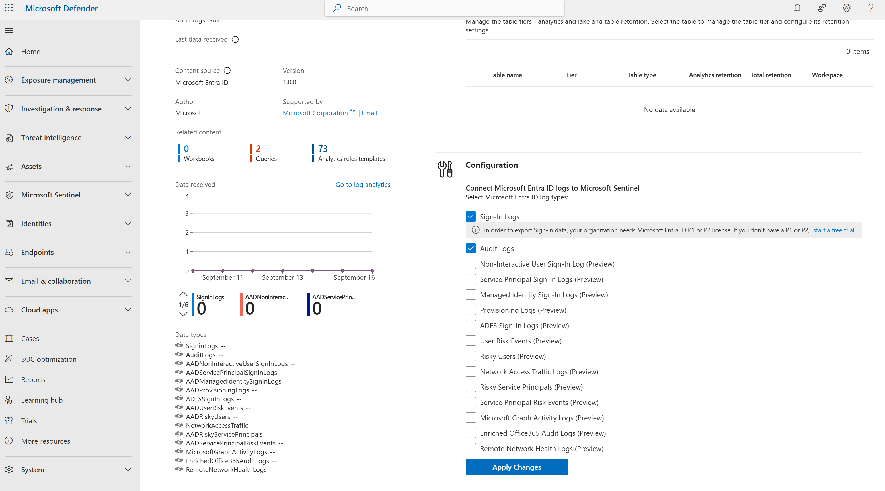
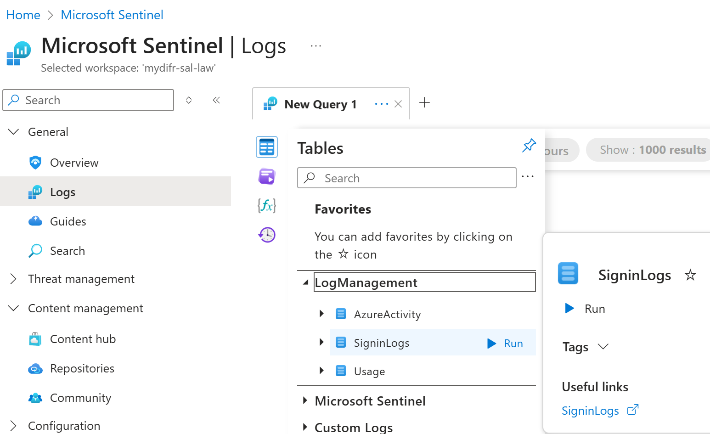
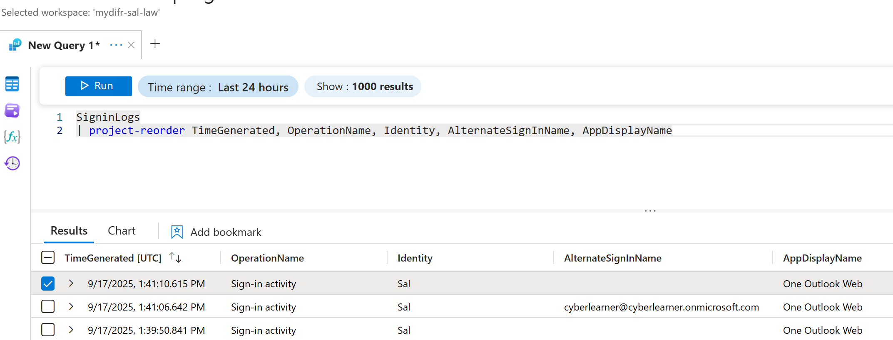
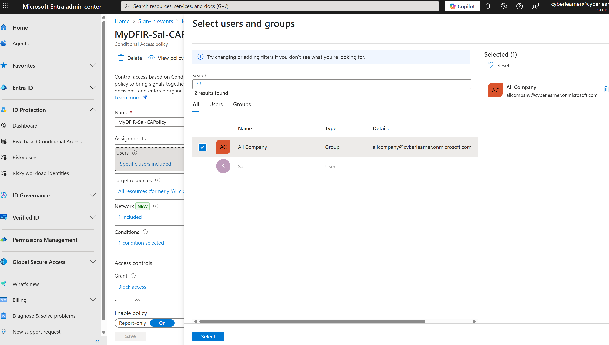
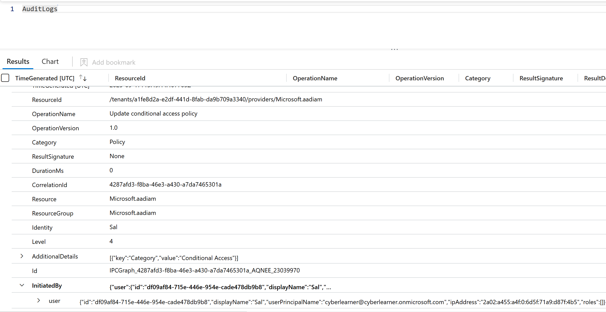

## Enable the Entra ID data connector in Microsoft Sentinel

- Enable the Entra ID data connector in Microsoft Sentinel.
- Make sure both Sign-in Logs and Audit Logs are being ingested.
- Run test queries against these tables to confirm data is flowing in.
- Take a screenshot of your query results.

The goal is to enable the Entra ID data connector in Microsoft Sentinel to bring Identity data into Microsoft Sentinel, so that we have identity, email and endpoint logs in one investigation workspace.

- Navigate to [Microsoft Defender XDR portal](https://security.microsoft.com/)
- Under `Microsoft Sentinel → Content management → Content hub`, search for "Entra ID" and install the connector

- Once installed, go to `Microsoft Sentinel → Configuration → Data connectors`. Select Microsoft Entra ID connector and click on `Open connector page` button. And select the logs you want to send to Microsoft Sentinel.

- After waiting for some time (30-60 minutes), login to your Outlook account to generate Sign-in logs and after that you will see the `SigninLogs` table in Sentinel

- Let's also generate some audit logs by modifying our conditional access policy (documented in Day 25). In this case I applied the policy to All Company, and this activity is tracked in `AuditLogs` in Sentinel.
 
