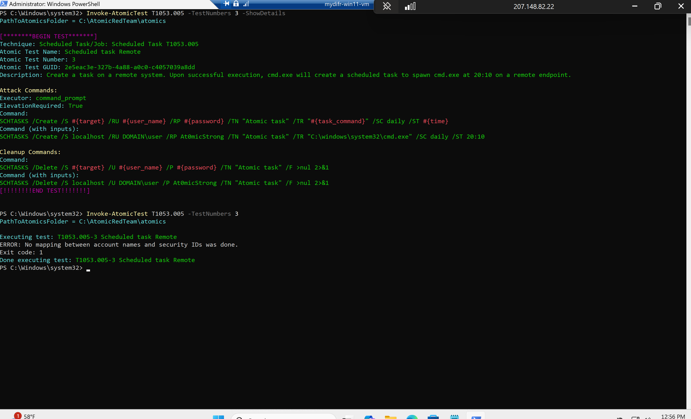
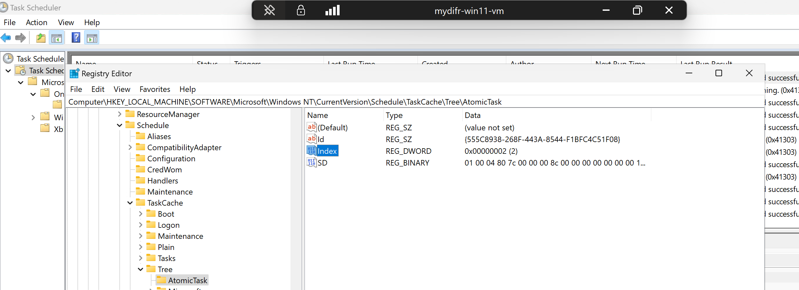

 # Mini-Project-Final – Saliha Tabbassum
 This is the final project of the 30-Day MyDFIR Microsoft Challenge.  It covers the following topics:
 1. Phishing email simulation: Created a fake phishing email and sent it to a test my account.
 2. Risky sign-in and impossible travel simulation: Logged in to my tenant/mailbox with my test account from a different region.
 3. Endpoint threat simulation: – Ran an Atomic Red Team technique on my test VM.
 4. Investigation report: Detailed investigation report that documents all the simulated activities.


 ## Step 1: Phishing email simulation
- Sent the following phishing email from an external email address to our test user (`cyberlearner@cyberlearner.onmicrosoft.com`). But the email was not received by our user's in the inbox, because it was quarantined.


- In Microsoft Defender, under `Èmail & collaboration -> Review`, select `Quarantine`. Select the email and click release it from quarantine (release for all recipients). 
 </br></br>
 </br></br>
 </br></br>

- Now we see the email in our test user's mailbox
 </br></br>

- We are assuming that `cyberlearner` received a Phishing email, which he thought is legit. He clicked the email and entered his credentials. So, in theory the attacker has captured our user's username and password. </br></br>


## Step 2: Risky sign-in and impossible travel simulation
Now the attacker has our user's credentials, and he can log in to user's account from anywhere in the world. Next let's assume that our attacker is located in Australia and simulate risky sign-in and impossible travel.

### Create an attacker VM
- First we will create an attacker VM in Vultur. The VM Specs are as follows:
    - Name: `EvilMyDifr-AU-VM`
    - Location: Australia
    - OS: Windows Server 2022 x64
    
    
    

### RDP into attacker VM
- RDP into the attacker's VM (the credentials can be copied from vultur) and verify that it is based in Australia 
 
 

### Sign-in from unknown and know location
We are assuming that the attacker already has credentials of `cyberlearner` (from the Phishing attack) and sign in using his email and password from Outlook. The attacker should be able to sign-in without the MFA prompt because we disabled `security defaults` earlier in Day 27. And the sign-in will not be blocked because we made conditional policy to block sign-ins only from Singapore.

**Sign-in to user's Outlook from attacker's VM**


**Sign-in by the actual user**

Let's also re-login from our host machine to our test user's account. This way we are trying to simulate impossible travel (a user sign-in's from a known location and after few minutes logs in from a totally different location which is impossible)


> This should generate telemetry for Risky sign-ins in Entra ID.


## Step 3: Endpoint activity simulation
Currently our user's endpoint (`mydifr-win11-vm`) is restricted to RDP from only one IP. Let's change the firewall (network security group) settings in Azure for our test VM to allow RDP anywhere from the internet.

 </br></br>

 </br></br>

 </br></br>

### Attacker RDP's from test user's machine
Now from our attacker VM (`EvilMyDifr-AU-VM`) we will RDP into our user's endpoint (`mydifr-win11-vm`). But first we'll have to enable the following:

- Open RDP, go to `Advanced` tab and enable `Use a web account to sign in to the remote computer`.

- Configure the `hosts` file in `C:\Windows\System32\drivers\etc` in Notepad with administrative access. This is done to resolve test user's hostname (mydifr-win11-vm) to an IP address as the attacker cannot RDP into the test VM with user's public IP address.

- Now RDP with test user's credentials from `EvilMyDifr-AU-VM`


We can see that the attacker is logged in as our user.


### Threat simulation
First three tests from Atomic Red Team for T1053.005 – Scheduled Task / Job were simulated as follows:





# Step 4: Investigation report

## FINDINGS:
**Endpoint**
- ScheduleTask_FirstSeen [UTC]: 2025-09-21T12:54:52.9974052Z 
- InitiatingProcessCommandLine: powershell.exe
- ProcessCommandLine: 
    - "cmd.exe" /c schtasks /create /tn "T1053_005_OnLogon" /sc onlogon /tr "cmd.exe /c calc.exe" & schtasks /create /tn "T1053_005_OnStartup" /sc onstart /ru system /tr "cmd.exe /c calc.exe"
    - "cmd.exe" /c SCHTASKS /Create /SC ONCE /TN spawn /TR C:\windows\system32\cmd.exe /ST 20:10
    - "cmd.exe" /c SCHTASKS /Create /S localhost /RU DOMAIN\user /RP ********** /TN "Atomic task" /TR "C:\windows\system32\cmd.exe" /SC daily /ST 20:10
    FolderPath: C:\Windows\System32\cmd.exe
- SHA256: ed1358cb5f7a7e4fa21e6b07ef1c6f664f0d363c60b4641aff43f5602a0b3f6e (cmd.exe) - clean
- DeviceName: mydifr-win11-vm
- InitiatingProcessRemoteSessionDeviceName: EVILMYDIFR-AU-VM
- InitiatingProcessRemoteSessionIP: 207.148.82.22
- IOC IPs: [64.227.97.195](https://www.virustotal.com/gui/ip-address/64.227.97.195/detection) (US), [207.148.82.22](https://www.virustotal.com/gui/ip-address/207.148.82.22) (AU)

**Risky sign-ins**
- RiskySignin_FirstSeen [UTC]: 2025-09-21T11:43:07.2843309Z
- Location: AU
- IP: 207.148.82.22
- AppDisplayName: cyberlearner@cyberlearner.onmicrosoft.com

**Phishing**
- PhishingEmail_FirstSeen [UTC]: 2025-09-21T11:01:58Z (13:01 Local Time)
- Sender: daniel_kim_tucker@outlook.com
- Recipient: cyberlearner@cyberlearner.onmicrosoft.com (Sal)
- Phishing URL: hxxps[://]docusign[.]com/
- Attachments: None

## ASSUMPTIONS:
- The threat actor is attempting to harvest credentials (True)
- The user entered their credentials on a credential harvesting website, resulting in account compromise (True)
- The threat actor has compromised user's account and gained persistence (True)
- The threat actor exfiltrated data over the C2 (False)

## INVESTIGATION:
On 2025-09-21T12:54:52.9974052Z [UTC], multiple schedule task alerts triggered under the "Hands-on keyboard attack was launched from a compromised account (attack disruption)" incident on host `mydifr-win11-vm` and belongs to user Sal (`cyberlearner@cyberlearner.onmicrosoft.com`). The malicious command were run from a remote host `EVILMYDIFR-AU-VM` with IP `207.148.82.22` based in Australia and an unauthorized RDP attempt towards `mydifr-win11-vm` was also observed from `64.227.97.195`. Further investigation revealed that account compromise happened because user clicked a malicious link in a Phishing email from the attacker and entered their credentials. However, no signs of lateral movement and data exfiltration were observed.

### ACTIONS:

#### Phishing email investigation

On 2025-09-21T11:01:58Z [UTC] user Sal received a Phishing Email from an external sender pretending to be from the finance department asking user to process a pending payment. The user clicked the link in the email which redirected to a login page that impersonated "Docusign". The user entered their credentials and got compromised. The email was initially blocked and quarantined, but the user requested a release.

- The email logs showed that only one user received an email from the external sender (daniel_kim_tucker@outlook.com), which was initially quarantined and blocked, but the user requested a release. The user clicked the malicious link, entered his credentials resulting in a compromise.

    ```
    EmailEvents
    | where TimeGenerated >= ago(1d)
    | where SenderFromAddress contains "daniel_kim_tucker@outlook.com"
    | join kind=leftouter (EmailUrlInfo) on NetworkMessageId
    | join kind=leftouter (EmailAttachmentInfo) on NetworkMessageId
    | project-reorder TimeGenerated,  SenderFromAddress, RecipientEmailAddress, Subject, Url, AttachmentCount, EmailDirection, DeliveryAction
    ```
    

    ```
    UrlClickEvents
    | where TimeGenerated >= ago(1d)
    ```

           

- If the Url is malicious 
    - A detonation in Urlscan.io might show the credential harvester 
    - VirtuTotal scan might flag it as Phishing. 

#### Risky sign-in investigation
- As the user's account is compromised, its worth checking Sign-in logs for any malicious activity. According to the logs the user usually sign-in's from NL but after the account compromise successful login attempts to user's Outlook account from an unusual location (AU) were observed with IP 207.148.82.22 at 2025-09-21T11:43:07.2843309Z [UTC].

    ```
    SigninLogs
    | where TimeGenerated >= ago(1d)
    | where AppDisplayName has "outlook"
    | where LocationDetails !contains "NL"
    | sort by TimeGenerated asc
    | project-reorder TimeGenerated, LocationDetails, AppDisplayName, IPAddress, UserDisplayName, UserPrincipalName, UserAgent
    ```

    

- Moreover, this activity also appeared in risky sign-in in Entra ID. The screenshot below is from an activity I simulated few days ago (September 17, 2025). When I logged in again from the attacker VM on September 21, 2025, a new risky sign-in entry was not generated. 


#### Endpoint investigation
The unusual sign-in from above activity confirms that the user account was compromised. Moreover, it was also confirmed with the user, and he denied of making any login attempts or using VPN from Australia.

##### Atomic Test #1 - Scheduled Task Startup Script

- At 2025-09-21T12:54:52.9974052Z [UTC], `"cmd.exe" /c schtasks /create /tn "T1053_005_OnLogon" /sc onlogon /tr "cmd.exe /c calc.exe" & schtasks /create /tn "T1053_005_OnStartup" /sc onstart /ru system /tr "cmd.exe /c calc.exe"` was executed. The command created two scheduled tasks back-to-back, named T1053_005_OnLogon and T1053_005_OnStartup that both run Calculator (calc.exe) when the event triggers. The attacker created these tasks with administrator privileges `/ru system`(higher privilege than a regular user)`

    ```
    union Device*
    | where TimeGenerated between (datetime(2025-09-21T12:53:44.2489549Z) .. datetime(2025-09-21T12:59:44.2489549Z))
    | sort by TimeGenerated asc
    | project-reorder TimeGenerated, Type, InitiatingProcessCommandLine, ProcessCommandLine, FileName, FolderPath, RemoteUrl
    ```

- At 2025-09-21T12:54:53.1611135Z [UTC], a registry keys was created for `T1053_005_OnLogon` followed by the task creation event at 2025-09-21T12:54:53.2175538Z [UTC]
    
    

- At 2025-09-21T12:54:53.2681787Z [UTC], a registry keys was created for `T1053_005_OnStartup` followed by the task creation event at 2025-09-21T12:54:53.3424834Z [UTC]
    
    

- Restarted user's VM and upon sign-in, we can see that a calculator app was opened automatically. Also, we can see the tasks created and ran successfully in the Task Scheduler along with entries created in the registry indicating Persistence.
    
    
    

##### Atomic Test #2 - Scheduled task Local

- At 2025-09-21T12:55:44.2489549Z `"cmd.exe" /c SCHTASKS /Create /SC ONCE /TN spawn /TR C:\windows\system32\cmd.exe /ST 20:10` was executed from PowerShell indicating that cmd.exe created a scheduled task to called `spawn` to spawn cmd.exe at 20:10.

- At 2025-09-21T12:55:44.344513Z [UTC], a registry key was created for `spawn` followed by the task creation event at 2025-09-21T12:55:44.4127347Z [UTC]


- After two seconds of the scheduled task creation, a malicious IP (64.227.97.195) made an unauthorized access attempt to port 3389 (tcp) towards user's machine. But no other activity related to this IP was found in the environment, so, it should be blocked.

    ```
    DeviceNetworkEvents
    | where TimeGenerated between (datetime(2025-09-21T12:53:44.2489549Z) .. datetime(2025-09-21T12:59:44.2489549Z))
    | where RemoteIP contains "64.227.97.195"
    | sort by TimeGenerated asc
    ```
    
    


##### Atomic Test #3 - Scheduled task Remote
- At 2025-09-21T12:56:45.360821Z [UTC], `"cmd.exe" /c SCHTASKS /Create /S localhost /RU DOMAIN\user /RP ********** /TN "Atomic task" /TR "C:\windows\system32\cmd.exe" /SC daily /ST 20:10` was executed. This command creates a scheduled task called "Atomic task" on the (local) machine that will run C:\Windows\System32\cmd.exe every day at 20:10 local time, and it will run under the domain account DOMAIN\user. The command includes a password argument (/RP **********) so the task will be able to run under that account even when no one is logged in. 





### RECOMMENDATIONS AND CONCLUSION
Even though the schedule task payloads are harmless (calc.exe, cmd.exe), these techniques are exactly what real adversaries use for persistence and privilege escalation. The system will keep executing the payloads on startup, logon or daily. However, no signs of lateral movement and data exfiltration were observed. No other user received the Phishing email from the sender and nor such activity was found on any other host in the environment. The following containment actions should be taken to neutralize the threat.

- Isolate user machine
- Advise user to change his password immediately.
- Advise user to restrict his VM's firewall settings for RDP to specific IPs only.
- Create CA policy to enforce MFA.
- Block IPs: {64.227.97.195, 207.148.82.22}
- Block sender: {daniel_kim_tucker@outlook.com}. We cannot block the domain (outlook.com) itself as it would have a business impact, but the sender can be blocked.
